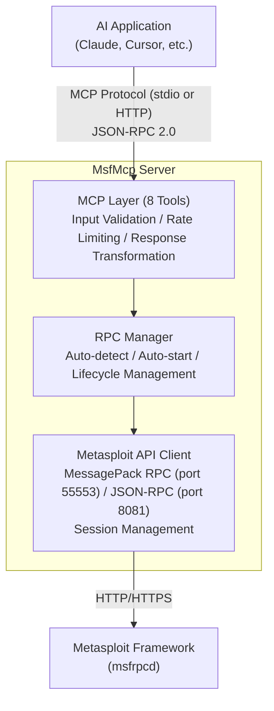

The Metasploit MCP Server (`msfmcpd`) provides AI applications with secure, structured access to Metasploit Framework data through the [Model Context Protocol](https://modelcontextprotocol.io/) (MCP). It acts as a middleware layer between AI clients (such as Claude, Cursor, or custom agents) and Metasploit, exposing 8 standardized tools for querying reconnaissance data and searching modules.

This initial implementation is **read-only**. Only tools that query data (modules, hosts, services, vulnerabilities, etc.) are available. Tools for module execution, session interaction, and database modifications will be added in a future iteration.

## Architecture



## Quick Start

The simplest way to start the MCP server is with no arguments:

```
./msfmcpd
```

The server automatically detects whether a Metasploit RPC server is already running on the configured port. If not, it starts one automatically with randomly generated credentials.

To use specific credentials:

```
./msfmcpd --user your_username --password your_password
```

## Configuration

### Configuration File

Copy the example configuration and edit it:

```
cp config/mcp_config.yaml.example config/mcp_config.yaml
```

A MessagePack RPC configuration looks like this:

```yaml
msf_api:
  type: messagepack
  host: localhost
  port: 55553
  ssl: true
  endpoint: /api/
  user: msfuser
  password: CHANGEME
  auto_start_rpc: true

mcp:
  transport: stdio

rate_limit:
  enabled: true
  requests_per_minute: 60
  burst_size: 10

logging:
  enabled: false
  level: INFO
  log_file: msfmcp.log
```

For JSON-RPC with bearer token authentication, use the JSON-RPC example instead:

```
cp config/mcp_config_jsonrpc.yaml.example config/mcp_config.yaml
```

### Command-Line Options

```
./msfmcpd --help

Options:
  --config PATH                Path to configuration file
  --enable-logging             Enable file logging with sanitization
  --log-file PATH              Log file path (overrides config file)
  --user USER                  MSF API username (for MessagePack auth)
  --password PASS              MSF API password (for MessagePack auth)
  --no-auto-start-rpc          Disable automatic RPC server startup
  --mcp-transport TRANSPORT    MCP server transport type ('stdio' or 'http')
  -h, --help                   Show this help message
  -v, --version                Show version information
```

### Environment Variable Overrides

All configuration settings can be overridden by environment variables:

| Variable | Description |
|---|---|
| `MSF_API_TYPE` | Connection type (`messagepack` or `json-rpc`) |
| `MSF_API_HOST` | Metasploit RPC API host |
| `MSF_API_PORT` | Metasploit RPC API port |
| `MSF_API_SSL` | Use SSL for Metasploit RPC API (`true` or `false`) |
| `MSF_API_ENDPOINT` | Metasploit RPC API endpoint |
| `MSF_API_USER` | RPC API username (for MessagePack auth) |
| `MSF_API_PASSWORD` | RPC API password (for MessagePack auth) |
| `MSF_API_TOKEN` | RPC API token (for JSON-RPC auth) |
| `MSF_AUTO_START_RPC` | Auto-start RPC server (`true` or `false`) |
| `MSF_MCP_TRANSPORT` | MCP transport type (`stdio` or `http`) |
| `MSF_MCP_HOST` | MCP server host (for HTTP transport) |
| `MSF_MCP_PORT` | MCP server port (for HTTP transport) |

Example using environment variables:

```
MSF_API_HOST=192.168.33.44 ./msfmcpd --config ./config/mcp_config.yaml
```

## Automatic RPC Server Management

When using MessagePack RPC on localhost, the MCP server can automatically manage the Metasploit RPC server lifecycle. This is enabled by default.

### How It Works

1. **Detection**: On startup, the MCP server probes the configured RPC port to check if a server is already running.
2. **Auto-start**: If no server is detected, it spawns the `msfrpcd` executable as a child process.
3. **Credentials**: If no username and password are provided, random credentials are generated automatically and used for both the RPC server and client authentication.
4. **Wait**: After starting, it polls the port until the RPC server becomes available (timeout: 30 seconds).
5. **Shutdown**: When the MCP server shuts down (via Ctrl+C or SIGTERM), it cleans up the managed RPC process.

**Note**: If an RPC server is already running, credentials must be provided via `--user`/`--password`, config file, or environment variables to authenticate with it.

### Database Support

The auto-started RPC server creates a framework instance with database support enabled by default. If the database is not running when the RPC server starts, a warning is displayed:

```
[WARNING] Database is not available. Some MCP tools that rely on the database will not work.
[WARNING] Start the database and restart the MCP server to enable full functionality.
```

Tools that query the database (`msf_host_info`, `msf_service_info`, `msf_vulnerability_info`, `msf_note_info`, `msf_credential_info`, `msf_loot_info`) require a running database. To initialize and start the database:

```
msfdb init
msfdb start
```

Then restart the MCP server.

### Disabling Auto-Start

Auto-start can be disabled in three ways:

- CLI flag: `--no-auto-start-rpc`
- Config file: `auto_start_rpc: false` in the `msf_api` section
- Environment variable: `MSF_AUTO_START_RPC=false`

Auto-start is also not available when:

- The API type is `json-rpc` (requires SSL certificates and a web server)
- The host is a remote address (cannot start a server on a remote machine)

When auto-start is disabled and no RPC server is running, you must start `msfrpcd` manually:

```
msfrpcd -U your_username -P your_password -p 55553
```

## MCP Tools

The server exposes 8 tools to AI applications via the MCP protocol.

### msf_search_modules

Search for Metasploit modules by keywords, CVE IDs, or module names.

- `query` (string, required): Search terms (e.g., `windows smb`, `CVE-2017-0144`)
- `limit` (integer, optional): Max results (1-1000, default: 100)
- `offset` (integer, optional): Pagination offset (default: 0)

### msf_module_info

Get detailed information about a specific Metasploit module.

- `type` (string, required): Module type (`exploit`, `auxiliary`, `post`, `payload`, `encoder`, `nop`)
- `name` (string, required): Module path (e.g., `windows/smb/ms17_010_eternalblue`)

Returns complete module details including options, targets, references, and authors.

### msf_host_info

Query discovered hosts from the Metasploit database.

- `workspace` (string, optional): Workspace name (default: `default`)
- `addresses` (string, optional): Filter by IP/CIDR (e.g., `192.168.1.0/24`)
- `only_up` (boolean, optional): Only return alive hosts (default: false)
- `limit` (integer, optional): Max results (1-1000, default: 100)
- `offset` (integer, optional): Pagination offset (default: 0)

### msf_service_info

Query discovered services on hosts.

- `workspace` (string, optional): Workspace name
- `names` (string, optional): Filter by service names, comma-separated (e.g., `http`, `ldap,ssh`)
- `host` (string, optional): Filter by host IP
- `ports` (string, optional): Filter by port or range (e.g., `80,443` or `1-1024`)
- `protocol` (string, optional): Protocol filter (`tcp` or `udp`)
- `only_up` (boolean, optional): Only return running services (default: false)
- `limit` (integer, optional): Max results (1-1000, default: 100)
- `offset` (integer, optional): Pagination offset (default: 0)

### msf_vulnerability_info

Query discovered vulnerabilities.

- `workspace` (string, optional): Workspace name
- `names` (array of strings, optional): Filter by vulnerability names (exact, case-sensitive module names)
- `host` (string, optional): Filter by host IP
- `ports` (string, optional): Filter by port or range
- `protocol` (string, optional): Protocol filter (`tcp` or `udp`)
- `limit` (integer, optional): Max results (1-1000, default: 100)
- `offset` (integer, optional): Pagination offset (default: 0)

### msf_note_info

Query notes stored in the database.

- `workspace` (string, optional): Workspace name
- `type` (string, optional): Filter by note type (e.g., `ssl.certificate`, `smb.fingerprint`)
- `host` (string, optional): Filter by host IP
- `ports` (string, optional): Filter by port or range
- `protocol` (string, optional): Protocol filter (`tcp` or `udp`)
- `limit` (integer, optional): Max results (1-1000, default: 100)
- `offset` (integer, optional): Pagination offset (default: 0)

### msf_credential_info

Query discovered credentials.

- `workspace` (string, optional): Workspace name
- `limit` (integer, optional): Max results (1-1000, default: 100)
- `offset` (integer, optional): Pagination offset (default: 0)

### msf_loot_info

Query collected loot (files, data dumps).

- `workspace` (string, optional): Workspace name
- `limit` (integer, optional): Max results (1-1000, default: 100)
- `offset` (integer, optional): Pagination offset (default: 0)

## Integration with AI Applications

Add the MCP server to your AI application configuration. The exact format depends on the client.

### Claude Desktop / Cursor

```json
{
  "mcpServers": {
    "metasploit": {
      "command": "/path/to/metasploit-framework/msfmcpd",
      "args": [
        "--config",
        "/path/to/config/mcp_config.yaml"
      ],
      "env": {}
    }
  }
}
```

### Using RVM

If you use RVM to manage Ruby versions, specify the full path to RVM so the correct Ruby and gemset are used:

```json
{
  "mcpServers": {
    "metasploit": {
      "command": "/your/home_dir/.rvm/bin/rvm",
      "args": [
        "in",
        "/path/to/metasploit-framework",
        "do",
        "./msfmcpd",
        "--config",
        "config/mcp_config.yaml"
      ]
    }
  }
}
```

## Security Considerations

### Input Validation

All tool parameters are validated against strict JSON schemas. IP addresses are validated using Ruby's `IPAddr` class with CIDR support, workspace names are restricted to alphanumeric characters plus underscore/hyphen, port ranges are validated (1-65535), and search queries are limited to 500 characters.

### Credential Management

Configuration files should use `chmod 600` permissions. Credentials are transmitted securely to the Metasploit Framework API and are never cached or logged by the MCP server.

### Rate Limiting

The server applies rate limiting to all MCP tools using a token bucket algorithm. Default: 60 requests per minute with a burst of 10 requests. This is configurable in the `rate_limit` section of the configuration file.

### Logging

Logging is disabled by default. When enabled (via `--enable-logging` or config), sensitive data (passwords, tokens, API keys) is automatically redacted. Log files should be protected with `chmod 600`.

### Error Handling

Stack traces are never exposed to clients. Error messages are sanitized to avoid leaking credentials. Metasploit API errors are wrapped in the MCP error format.

## Testing with MCP Inspector

The [MCP Inspector](https://github.com/modelcontextprotocol/inspector) is an interactive developer tool for testing and debugging MCP servers. It runs directly through `npx`:

```
npx @modelcontextprotocol/inspector
```

## Troubleshooting

### Connection Refused or Timeout

1. Verify the RPC daemon is running: `ps aux | grep msfrpcd`
2. Check the port is listening: `netstat -an | grep 55553`
3. Test connectivity: `curl -k -v https://localhost:55553/api/`

### Authentication Failures

For MessagePack RPC, verify the username and password in your configuration file or CLI arguments. For JSON-RPC, verify the bearer token is valid and has not expired.

### Database Not Available

If database-dependent tools return errors, ensure the database is running:

```
msfdb init
msfdb start
```

Then restart the MCP server.

### Rate Limit Exceeded

Increase the rate limit in your configuration file:

```yaml
rate_limit:
  requests_per_minute: 120
  burst_size: 20
```
