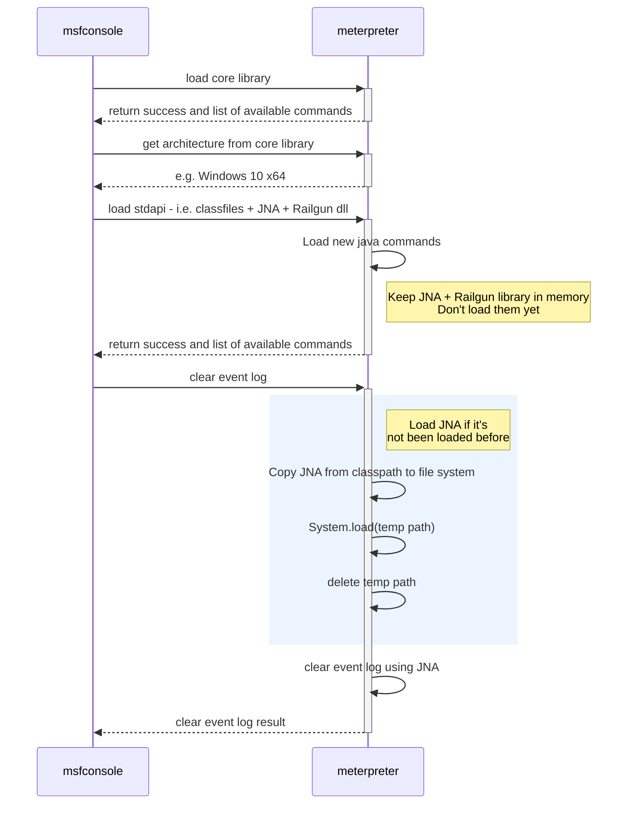
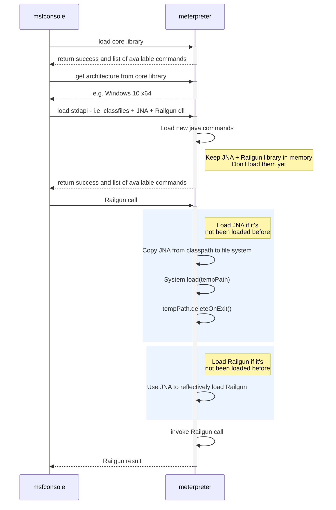
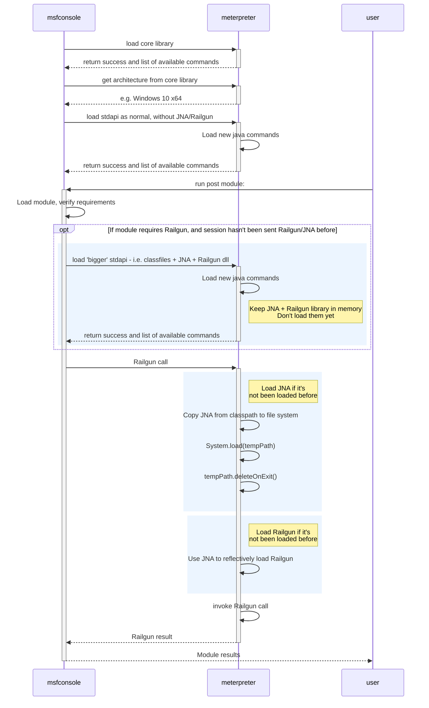

# Java Meterpreter Feature Parity

Metasploit Framework has separate Meterpreter implementations for different platforms. Currently there is a feature
disparity between e.g. Windows (x86) and PHP, Python and Java. For instance the Java Meterpreter only implements 25% of
stdapi on windows, in comparison to the Python Meterpreter's 50% coverage, or the Window's Meterpreter at 94% coverage.

Java does have out of the box support for many of the library calls that we would require for improving Meterpreter
compatibility, i.e. to manipulate the Windows event log, support Railgun etc.

To implement feature parity the following pull request were spiked:

- [Add `clearev` command on Windows using JNA](https://github.com/rapid7/metasploit-payloads/pull/524) - Adding Meterpreter's event log manipulation commands. Uses an
  off-the-shelf library for making native system calls via [JNA](https://github.com/java-native-access/jna). This
  approach would allow for implementation of the remaining calls that aren't supported by Java out of the box.
- [Add Railgun support to Java Meterpreter against Windows](https://github.com/rapid7/metasploit-payloads/pull/529) - Using a custom library for Railgun support

This proposal evaluates different approaches on how this feature parity could be achieved, what difficulties we have
faced, and the future work required.

## Glossary

- **FFI** - **Foreign Function Interface** - A foreign function interface (FFI) is a mechanism by which a program
  written in one programming language can call routines or make use of services written in another.
- **JNI** - **Java Native Interface** is a foreign function interface programming framework that enables Java code
  running in a Java Virtual Machine (JVM) to call and be called by native applications (programs specific to a hardware
  and operating system platform) and libraries written in other languages such as C, C++ and assembly.
- **[JNA](https://github.com/java-native-access/jna)** - **Java Native Access** is a community-developed library that
  provides Java programs easy access to native shared libraries, under the covers it uses still JNI - only supports Java
  1.6+
- **Railgun** - Meterpreter API which allows for programmatic access to native libraries via Ruby. Window's
  Implementation is available
  [here](https://github.com/rapid7/metasploit-payloads/blob/6e08d1f9812aa4d7a76b451fd5e0bae03975bb91/c/meterpreter/source/extensions/stdapi/server/railgun/railgun.c#L73-L76).

## Solution Overview

To improve the Java Meterpreter's feature parity we will:

- Add support for native system calls
- Add support for Railgun capabilities

To implement this functionality we will:

- Use the open source JNA library for generic system calls
- Create a custom C library for Railgun support
- Update core api to expose system information to deduce the platform type
- Update Java stdapi to now include the library files for Railgun + JNA by default, i.e. the dll/so/dylib files for
  Railgun/JNA - an extra ~200KB uncompressed on top of the existing 54KB compressed (228KB uncompressed)
- Load the Railgun/JNA libraries on demand when the Meterpreter command is invoked, for now this will require a write to
  disk - discussed further below
- Update CI/Maven build steps

Alternative implementation steps are also documented.

## Implementation

### Supporting native system calls

We will move the OS detection from `stdapi` to `core`. This would allow us to detect the victim's OS and architecture as
part of the `core` API, allowing stdapi to additionally include the correct Railgun and the JNA dll/so/dylib library
files.

Native call support will be provided by JNA - an open source library which provides easy access to Window's APIs. Using
JNA would help reduce the boilerplate for making Windows API calls, is maintained by an existing community, and is less
likely to be detected as malicious.

The sequence of steps required for loading stdapi and invoking clear event log:

### Railgun support

Railgun requires access to low-level functionality, i.e. directly manipulating memory etc. Java does not support this
functionality directly unless a Java wrapper is provided. Therefore a JNI wrapper for the current Railgun implementation
will be developed - similar to the previous [prototype](https://github.com/rapid7/metasploit-payloads/pull/529). Maven
would be updated to build this library for different architectures/platforms.

Similar to the implementation of native system calls; We will move the OS detection from `stdapi` to `core`. This would
allow us to detect the victim's OS and architecture as part of the `core` API, allowing `stdapi` to additionally include
the correct Railgun and JNA dll/so/dylib library files. Once a native call needs to be executed, Meterpreter would
attempt to load JNA and use it to the native Windows API to begin the process of reflectively loading the compiled
Railgun library.

The sequence of steps required for loading stdapi and invoking Railgun:

For an initial release the Railgun and JNA libraries would be sent as part of stdapi. This would increase the size to
about 200KB on top of the 70KB Meterpreter Jar (228KB uncompressed). We will also keep Railgun in `stdapi` (where it
currently lives).

### Alternative Implementation 1

An alternative solution to updating stdapi to additionally include Railgun/JNA - is to keep stdapi as it exists today,
and to attempt loading a ‘bigger' stdapi with the additional Railgun functionality when a post module requires Railgun.

This would work as follows:

Unfortunately the Meterpreter compatibility data in modules are not granular enough - and it is likely that a post
module will implicitly load Railgun via a transitive module mixin. For instance, at the time of writing the
[lib/msf/core/post/file.rb](https://github.com/rapid7/metasploit-framework/blob/b7a014a5d22d3b57157e301d4af57e3a31ad03a9/lib/msf/core/post/file.rb#L31)
mixin specifies a requirement on Railgun. This would result in most modules sending the Railgun/JNA libraries to
Meterpreter when they are not required, as it is unlikely that the `get_drives` method would be invoked. This
compatibility metadata could be improved, but is a blocker for this implementation.

### Alternative Implementation 2

An alternative implementation to moving the architecture detection from `stdapi` to `core` - would be to include all
possibly supported platform types for the JNA / Railgun libraries - approx. 3MB of additional data. This is not a viable
solution.

## Loading Libraries

Java supports loading native libraries with either `System.load(String libname)` or
`System.loadLibrary(String filename)`. These methods require writing the shared library to disk temporarily, as it does
not support loading libraries from memory.

When temporarily extracting the JNA library to disk, we would need to make sure that we can delete it when we are done
with the Meterpreter session. This can be achieved using Java's `File.deleteOnExit()` method. This is executed only if
the session exits as expected; crashes or getting killed by the AV results in the library being left on disk.

Writing a shared library to disk is an easy way to get flagged by an AV that's running on the victim's machine. This
might not be an issue as to get a Java Meterpreter session in the first place, e.g. the Microsoft Defender AV has to be
disabled, and the JNA library might be white-listed.

Another approach that we have briefly evaluated is running shellcode from Java without using JNI, which may be possible
with [schierlm's Java Shellcode prototype](https://github.com/schierlm/JavaPayload/blob/ec39092ad688d424755c3b289e022a40b01d635a/JavaPayload/src/javapayload/stage/JITShellcodeRunner.java).
Which can execute shellcode in memory. There may be compatibility edge cases with each JDK/JRE version - depending on
the JVM memory layout. This approach has only been verified to work on 32 bit Oracle Java 6. Each Java version may
require additional logic, and automated/manual verification steps to ensure it works as expected. The development effort
to support x64 is currently unknown. The shellcode used with the JIT Shellcode Runner would let us load a shared library
from memory. This would avoid the need to write the shared library to disk.

Therefore, short term solution:

- Write JNA to disk, as it's got a higher chance of being allowed by the file system
- Use JNA to reflectively load our custom Railgun C library - resulting in the Railgun library not being written to disk

Long term solution:

- Attempt to reflectively load JNA via reflection, which may be possible with
  [schierlm's Java Shellcode prototype](https://github.com/schierlm/JavaPayload/blob/ec39092ad688d424755c3b289e022a40b01d635a/JavaPayload/src/javapayload/stage/JITShellcodeRunner.java) -
  but the proof of concept was only verified to currently work with 32bit Java 1.7, and may not work on newer versions
- Use the above reflection approach to also load Railgun

## CI/Maven changes

Maven would be updated to support building the Railgun libraries for each platform/architecture type that is supported.
The required build artifacts would be chosen at runtime by msfconsole and sent to the Java Meterpreter session as part
of `stdapi`. An alternative to msfconsole bundling the stdapi dependencies at runtime, would involve building multiple
pre-built Meterpreter Jar files for all of the possible platform/architectures.

## Conclusion

There are quite a few moving parts to implementing this solution for Java. The simplest approaches have been chosen for
this proposal.
