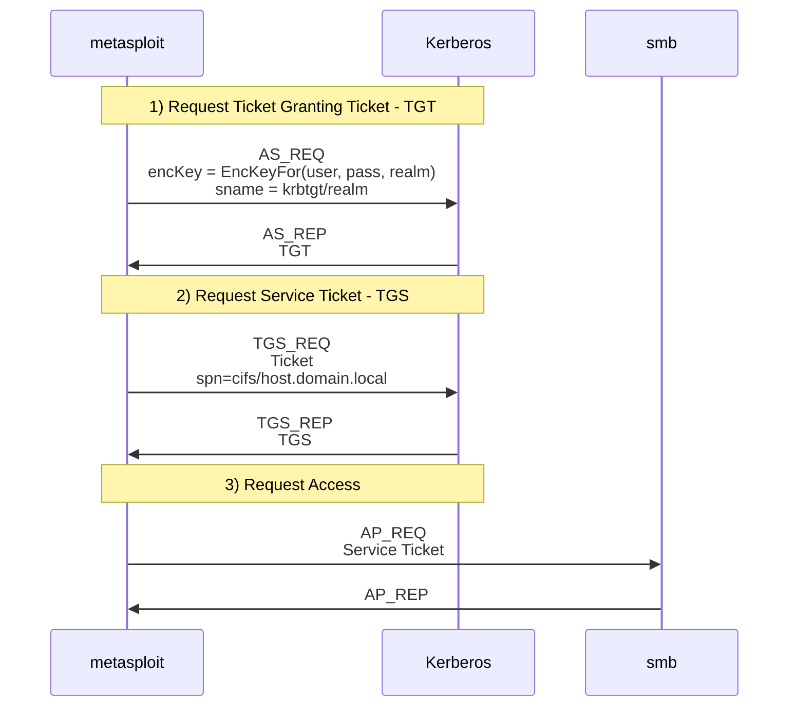
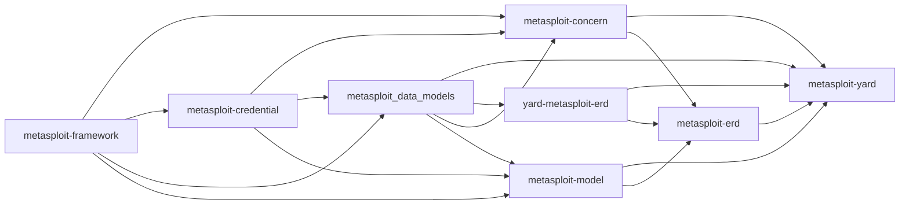

## Metasploit Credential Kerberos Support Proposal

Metasploit is adding support for Kerberos. We wish to persisting the following details when interacting with a Kerberos Server.

Common Terminology:
- Service Principal Name ([SPN](https://learn.microsoft.com/en-us/openspecs/windows_protocols/ms-adts/cd328386-4d97-4666-be33-056545c1cad2)) - Forest unique string. Associates a service to a service logon account.
  The SPN is set on a user pr computer object via the [AD Schema](https://learn.microsoft.com/en-us/windows/win32/adschema/a-serviceprincipalname). Generally in the form `<service class>/<host><realm>:<port>/<service name>`.
  A service can have multiple SPNs. Viewable on a Windows DC with `setspn -q */*`.
- Key Distribution Center (KDC) - Performs authentication and creates tickets

## Requirements

Persisting the following information:

1. Kerberos Encryption Keys - Either calculated with provided user/pass/realm details, or extracted from target
2. Ticket granting tickets (TGT) - Requested after using the kerberos encryption key to prove identity
3. Service Tickets (TGS) - Used to prove authenticate with a target system such as SMB etc. 

There should be support for:

- Finding kerberos TGS/TGT tickets based on workspace, host (kdc), username (case insensitive), realm, sname (i.e. the kdc `krbtgt/host.realm`, or a service `cifs/host.realm`), auth time
- Exporting kerberos encryption keys - either previously computed keys from user's creds, or from secrets dump. Useful for forging tickets, or decrypting wireshark traffic

## Scenarios

### Persisting kerberos Encryption Keys

Context:

Used when requesting a Kerberos Ticket Granting Ticket. Initially the key proves that you know the password when authenticating with Kerberos.
Not all encryption keys are generated from passwords, they can be randomly generated for ephemeral communication.

Generally acquired by:
- Generating from private data - username + password + AD realm private data
- Extracted from DCERPC (i.e. secretsdump)
- Calculated from machine keys extracted from secretsdump

Example:

```ruby
realm = "DEMO/LOCAL"
principal = "Administrator"
  
salt = "#{realm}#{principal.split('/')[0]}"
krb_enc_key = {
  enctype: Rex::Proto::Kerberos::Crypto::Encryption::AES256,
  key: kerberos_aes256(password, salt),
  salt: salt
}
```

### Persisting Ticket granting ticket - TGT

Context:
Can be used to request additional tickets from the KDC

Generally acquired by:

- Request from KDC using username/password/AD Realm as proof of identity
- Extracted from memory via Window’s lsa/lsass
- Forging (Golden tickets)

Example:

```ruby
kdc_response = send_request(krb_enc_key)
cred = Rex::Proto::Kerberos::CredentialCache::Krb5Ccache(kdc_response)

{
  type: :tgt,
  sname: "krbtgt/realm.local",
  value: cred.to_binary_s, 
  authtime: cred.authtime.to_time,
  starttime: cred.starttime.to_time,
  endtime: cred.endtime.to_time
}
```

### Ticket Granting Service - TGS

Context: Can be used with a real service (cifs/mssql/etc) for authentication

Generally acquired by:
- Request from KDC using a previous TGT
- Extracted from memory via Window’s lsa/lsass
- Forging (Silver tickets)


```ruby
kdc_response = send_request(ticket)
cred = Rex::Proto::Kerberos::CredentialCache::Krb5Ccache(kdc_response)

{
  type: :tgs,
  sname: "arbitrary_service_class/host.realm.local:1433",
  value: cred.to_binary_s, 
  authtime: cred.authtime.to_time,
  starttime: cred.starttime.to_time,
  endtime: cred.endtime.to_time
}
```

### Kerberos Overview 

- Step 1. Request TGT
  - AS_REQ
    - Generate Kerberos Encryption key from user credentials
    - Persisted and stored for later use in a keytab file for wireshark decryption
    - Requested with sname = “krbtgt/#{realm}”
  - AS_REP
    - Stored for later usage to request future service tickets
- Step 2. Request Service Ticket
  - TGS_REQ
    - Use the TGT from Step 1
    - Specify SPN (Service principal name), i.e. `cifs/host.realm.local`
  - TGS_REP
    - Receive new TGS which we can use with a service
- Step 3. Interact with service
    - AP_REQ
      - Send the service ticket
    - AP_REP
      - Success/Failure information



### Pre-requisite metasploit-credential knowledge

### Additional context/domain knowledge

`Metasploit::Credential::Core` is a glue object between the various objects in metasploit-credential - here's the rendered version of the outdated [credential.graffle](https://github.com/rapid7/metasploit-credential/blob/55db9fc85fe690bf82aa66b3e4a6baa81f043b02/doc/graffles/metasploit-credential.graffle) file:


- **Core** - Glue object. Core credential that combines `{#private}`, `{#public}`, and/or `{#realm}` so that `{Metasploit::Credential::Private}` or `{Metasploit::Credential::Public}` that are gathered from a `{Metasploit::Credential::Realm}` are properly scoped when used
- **Public** - A publicly disclosed credential, i.e. a `username`
- **Private** - A private credential is any credential that should not be publicly disclosed, such as a `{Metasploit::Credential::Password password}`, password hash, or key file.
- ~~Context~~ - Was renamed to `Realm`
- **Origin** - Where the credentials came from, i.e. session/import/crackedpassword/manual/service
- **Login** - The use of a `{#core core credential}` against a `{#service service}`
- **Realm** - The realm in which a `{Metasploit::Credential::Public}` can be used to authenticate or from which a `{Metasploit::Credential::Private}` was looted.

The gem dependencies/hierarchy:



Gem overviews:

- metasploit-yard - Documentation generation
- metasploit-erd - Documentation generation
- yard-metasploit-erd - Documentation generation
- metasploit-model - Shared validators and mixins for ActiveModels in metasploit-framework and  metasploit_data_models
- metasploit_data_models - Rails ORM models
- metasploit-concern  - Rails/Metasploit extension library
- metasploit-credential - Rails ORM models
- metasploit-framework

## Implementation

### Current loot approach

In the initial loot approach:
- We store TGT/TGS creds in loot with hand calculated metadata

Logging in stores the original cred against the service, instead of against Kerberos 

```
msf6 auxiliary(scanner/winrm/winrm_login) > creds
Credentials
===========

host            origin          service          public         private   realm       private_type  JtR Format
----            ------          -------          ------         -------   -----       ------------  ----------
192.168.123.13  192.168.123.13  5985/tcp (http)  Administrator  p4$$w0rd  adf3.local  Password      
```

And the TGT/TGS is stored as loot:

```
msf6 auxiliary(scanner/winrm/winrm_login) > loot

Loot
====

host            service  type                 name  content                   info                                                                          path
----            -------  ----                 ----  -------                   ----                                                                          ----
192.168.123.13           mit.kerberos.ccache        application/octet-stream  realm: ADF3.LOCAL, serviceName: krbtgt/adf3.local, username: administrator    /Users/user/.msf4/loot/067f9904163fac90080d-20221202011513_default_192.168.123.13_mit.kerberos.cca_789425.bin
192.168.123.13           mit.kerberos.ccache        application/octet-stream  realm: ADF3.LOCAL, serviceName: http/dc3.adf3.local, username: administrator  /Users/user/.msf4/loot/20221207151506_default_192.168.123.13_mit.kerberos.cca_180875.bin
```

Benefits:
- User can see arbitrary metadata as part of the `loot` command 

Shortcomings:
- the `store_loot` API can be used regardless of having a Metasploit database connected
- Isn't a valid approach for persisting kerberos keys
- Doesn't appear as part of the `creds` command

### Initial metasploit-credential approach 

In the initial approach we:
- Add two new metasploit-credential privates:
  - KrbEncKey - The enc type / key / salt derived from user provided credentials
  - KrbTicket - From a KDC/Forged/in memory dumping - either TGS or TGT
- Add the KrbEncKey/KrbTicket persistence to a generic Kerberos service authenticator object

Not everyone wants to persist/reuse keys/tickets when calling kerberos authentication, requiring hacky "do not persist" and "do not use cache" flags.
Or, for login scanners - the login scanner persists the user/password cred against the service, i.e. WinRM.

After running the `winrm_login` module this results in the following creds output:

```
msf6 auxiliary(scanner/winrm/winrm_login) > creds
Credentials
===========

host             origin           service            public         private                                                                                              realm       private_type  JtR Format
----             ------           -------            ------         -------                                                                                              -----       ------------  ----------
192.168.123.13   192.168.123.13   88/tcp (kerberos)  Administrator  aes256-cts-hmac-sha1-96:56c3bf6629871a4e4b8ec894f37489e823bbaecc2a0a4a5749731afa9d158e0 (TRUNCATED)  ADF3.LOCAL  Krb enc key   
192.168.123.13   192.168.123.13   88/tcp (kerberos)  Administrator  tgs:http/win10-dc3.adf3.local:ccache:BQQAAAAAAAEAAAABAAAACkFERjMuTE9DQUwAAAANQWRtaW5pc3 (TRUNCATED)  ADF3.LOCAL  Krb ticket    
192.168.123.13   192.168.123.13   88/tcp (kerberos)  Administrator  tgt:krbtgt/ADF3.LOCAL:ccache:BQQAAAAAAAEAAAABAAAACkFERjMuTE9DQUwAAAANQWRtaW5pc3RyYXRvcg (TRUNCATED)  ADF3.LOCAL  Krb ticket    
192.168.123.144  192.168.123.144  5985/tcp (http)    Administrator  p4$$w0rd                                                                                             adf3.local  Password      

msf6 auxiliary(scanner/winrm/winrm_login) > 
```

What we would ideally want is:

```diff
  msf6 auxiliary(scanner/winrm/winrm_login) > creds
  Credentials
  ===========
  
  host             origin           service            public         private                                                                                              realm       private_type  JtR Format
  ----             ------           -------            ------         -------                                                                                              -----       ------------  ----------
  192.168.123.13   192.168.123.13   88/tcp (kerberos)  Administrator  aes256-cts-hmac-sha1-96:56c3bf6629871a4e4b8ec894f37489e823bbaecc2a0a4a5749731afa9d158e0 (TRUNCATED)  ADF3.LOCAL  Krb enc key   
- 192.168.123.13   192.168.123.13   88/tcp (kerberos)  Administrator  tgs:http/win10-dc3.adf3.local:ccache:BQQAAAAAAAEAAAABAAAACkFERjMuTE9DQUwAAAANQWRtaW5pc3 (TRUNCATED)  ADF3.LOCAL  Krb ticket    
+ 192.168.123.13   192.168.123.13   5985/tcp (kerberos)  Administrator  tgs:http/win10-dc3.adf3.local:ccache:BQQAAAAAAAEAAAABAAAACkFERjMuTE9DQUwAAAANQWRtaW5pc3 (TRUNCATED)  ADF3.LOCAL  Krb ticket    
  192.168.123.13   192.168.123.13   88/tcp (kerberos)  Administrator  tgt:krbtgt/ADF3.LOCAL:ccache:BQQAAAAAAAEAAAABAAAACkFERjMuTE9DQUwAAAANQWRtaW5pc3RyYXRvcg (TRUNCATED)  ADF3.LOCAL  Krb ticket    
- 192.168.123.144  192.168.123.144  5985/tcp (http)    Administrator  p4$$w0rd                                                                                             adf3.local  Password       
+ 192.168.123.144  192.168.123.144  88/tcp (http)      Administrator  p4$$w0rd                                                                                             adf3.local  Password      
  
  msf6 auxiliary(scanner/winrm/winrm_login) > 
```

Unfortunately it's not always possible to correlate a TGS request to the service in question. i.e. in the scenario of
the user running the `admin/kerberos/get_ticket` module with `un verbose=true rhosts=10.0.0.24 domain=mylab.local user=serviceA password=123456 action=GET_TGS spn=custom_spn/dc02.mylab.local impersonate=Administrator`

Benefits:

- Tgt/Tgs information appears as part of the `creds` command by default
- Easy to iterate on, and we can add a separate `klist` command implementation later
- We can store the Kerberos enc key information in isolation of a JTR format, and it can be queried for separately when exporting to keytab format.
  The available JTR ripper formats only supports the combination of key/salt plus kerberos response - which does not apply for secrets dump:
  - `7500 Kerberos 5, etype 23, AS-REQ Pre-Auth $krb5pa$23$user$realm$salt$4e751db65422b2..etc...`
  - `13100 Kerberos 5, etype 23, TGS-REP *user$realm$test/spn*$63386d22d359fe42230..etc...`
  - `18200 Kerberos 5, etype 23, AS-REP user@domain.com:3e156ada591263b8aab0965f5aebd837$007497cb51b6c8116d6407a78...etc...`
  - etc
- Easier to integrate with Pro

Shortcomings:

- Can't invalidate private information, i.e. due to tickets expiring or being rejected from a KDC etc.
- Noise in private key information
- Privates have a single data field which is assumed to be a string. It's not possible to add
  additional fields due to the current rails sti approach (single table inheritance). Which requires a workaround of using rail's `serialize` to store JSON blobs,
  and re-inventing active record's field validation.
- Related to the above; The default search capabilities for private creds assumes string and break on serialized json blobs
- Not everyone wants to persist/reuse keys/tickets when calling kerberos authentication, requiring hack-y "do not persist" and "do not use cache" flags
- No way to search directly via the database for SPN
- When running the `creds` command there's not a correlation between the SPN and the target/host that it can be used against
- Will require extra changes to Pro as part of MVP to not break the UI

### Revised approach

We need a better implementation to reconcile the above shortcomings; Initial thoughts are to store the TGT/TGS metadata on the metasploit-credential
login object. This login object would allow for tracking arbitrary metadata such as SPN details, expiry details etc. This implementation should also
cater for other login metadata - such as http cookies etc.

After we have logged in to winrm_login with valid Kerberos credentials the TGT/TGS would not be placed in the creds table:

```diff
msf6 auxiliary(scanner/winrm/winrm_login) > creds
Credentials
===========

host             origin           service            public         private                                                                                              realm       private_type  JtR Format
----             ------           -------            ------         -------                                                                                              -----       ------------  ----------
192.168.123.13   192.168.123.13   88/tcp (kerberos)  Administrator  aes256-cts-hmac-sha1-96:56c3bf6629871a4e4b8ec894f37489e823bbaecc2a0a4a5749731afa9d158e0 (TRUNCATED)  ADF3.LOCAL  Krb enc key   
192.168.123.144  192.168.123.144  88/tcp (http)      Administrator  p4$$w0rd                                                                                             adf3.local  Password      

msf6 auxiliary(scanner/winrm/winrm_login) > 
```

We would then have a separate `logins` command to keep track of currently valid session information:

```
msf6 auxiliary(scanner/winrm/winrm_login) > logins 
Credentials
===========

host             origin           service              public         private                                                                                              realm       status      login_type    created_at
----             ------           -------              ------         -------                                                                                              -----       ------      ------------  ----------
192.168.123.13   192.168.123.13   88/tcp (kerberos)    Administrator  tgt:krbtgt/ADF3.LOCAL:ccache:BQQAAAAAAAEAAAABAAAACkFERjMuTE9DQUwAAAANQWRtaW5pc3RyYXRvcg (TRUNCATED)  ADF3.LOCAL  successful  Krb ticket    2022-11-29 02:07:19 UTC
192.168.123.13   192.168.123.13   88/tcp (kerberos)    Administrator  tgs:http/win10-dc3.adf3.local:ccache:BQQAAAAAAAEAAAABAAAACkFERjMuTE9DQUwAAAANQWRtaW5pc3 (TRUNCATED)  ADF3.LOCAL  expired     Krb ticket    2022-11-29 02:07:19 UTC
192.168.123.13   192.168.123.13   5985/tcp (kerberos)  Administrator  tgs:http/win10-dc3.adf3.local:ccache:BQQAAAAAAAEAAAABAAAACkFERjMuTE9DQUwAAAANQWRtaW5pc3 (TRUNCATED)  ADF3.LOCAL  expired     Krb ticket    2022-11-29 02:07:19 UTC
192.168.123.13   192.168.123.13   5985/tcp (kerberos)  Administrator  tgs:http/win10-dc3.adf3.local:ccache:BQQAAAAAAAEAAAABAAAACkFERjMuTE9DQUwAAAANQWRtaW5pc3 (TRUNCATED)  ADF3.LOCAL  expired     Krb ticket    2022-11-29 02:07:19 UTC
192.168.123.13   192.168.123.13   5985/tcp (kerberos)  Administrator  tgs:http/win10-dc3.adf3.local:ccache:BQQAAAAAAAEAAAABAAAACkFERjMuTE9DQUwAAAANQWRtaW5pc3 (TRUNCATED)  ADF3.LOCAL  expired     Krb ticket    2022-11-29 02:07:19 UTC
192.168.123.13   192.168.123.13   5985/tcp (kerberos)  Administrator  tgs:http/win10-dc3.adf3.local:ccache:BQQAAAAAAAEAAAABAAAACkFERjMuTE9DQUwAAAANQWRtaW5pc3 (TRUNCATED)  ADF3.LOCAL  expired     Krb ticket    2022-11-29 02:07:19 UTC

msf6 auxiliary(scanner/winrm/winrm_login) > 
```

The logins command would only show you valid logins by default, i.e. ignore any entries which have explicitly been invalidated iwth `invalidate_login(...)` or the expiry has surpassed (Or for kerberos, a mix of authtime/starttime/endtime)
For kerberos - that would potentially require sharing the same TGS information pointers, i.e. one TGS being used to log in multiple times, or implementing idempotency - so additional logins with the same TGS modifies an existing entry.

Benefits:

- Can be implemented without breaking Pro; but will require extra dev cycles to integrate

Shortcomings:
- More work to implement
- Logins won't appear as part of the `creds` command by default
- Requires additional effort to integrate with Pro

Other issues not resolved:
- s4u/s4u2proxy have additional metadata present for the user that they are impersonating. It's not clear how to represent that model with metasploit-credential
- There's currently no support for multi-realm metadata, which is a requirement for multi-realm Kerberos tickets
