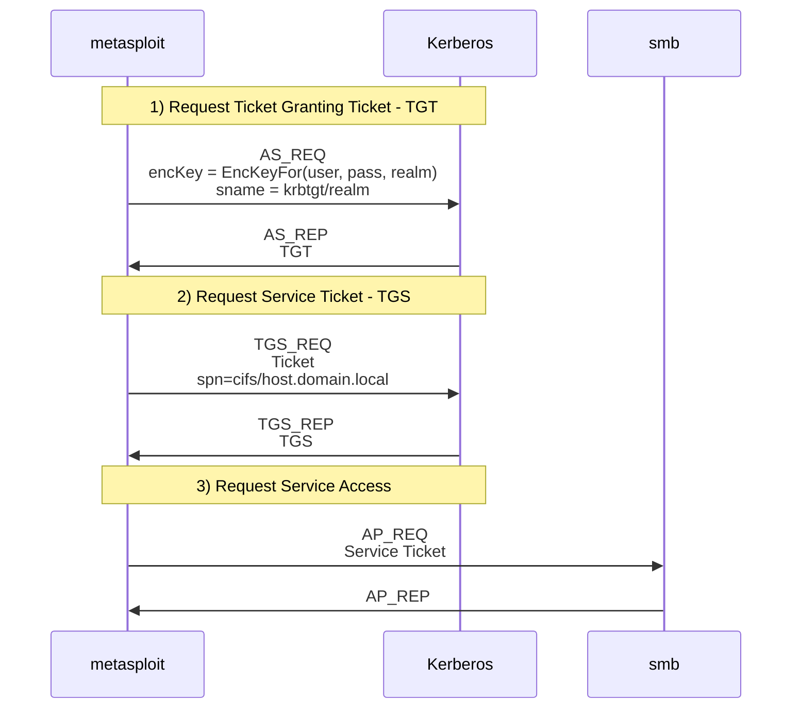

## What is Kerberos?

Kerberos is an authentication protocol. In response to a client proving their identity, Kerberos generates tickets which
can be used to further interact with systems as a proof of identity. Kerberos is not used for authorization. NTLM is an
alternative authentication protocol implemented in Microsoft Products. The difference between authentication and authorization is:

- Authentication - Verification of identity
- Authorization - Verification of access rights. This takes place after authentication.

Kerberos can be found on the following ports:

- 88/TCP - More frequently used, and supported by Metasploit
- 88/UDP - Currently not supported by Metasploit

Metasploit currently provides modules for requesting authentication tickets, forging tickets, exploitation, and more.

## Core Concepts

### Key Distribution Centre

The Key Distribution center consists of two parts. The Authentication server (AS) and the Ticket Granting Server (TGS).

The Authentication server (AS) performs the client authentication process. Authentication is generally performed using a
secret key such as the user's password - but other methods such exist such as `pkinit` which relies on public keys for authentication.
If authentication is successful, the authentication server will return a new Ticket Granting Ticket (TGT).

The Ticket Granting Server requires a user's TGT, and the service details that the user would like to gain access to. These
Service Tickets used are for gaining access to services such as SMB/WinRM/etc. In most Kerberos pentesting tools, including Metasploit, the granted
Service Tickets are called TGS.

### Service Principal Name

A ([SPN](https://learn.microsoft.com/en-us/openspecs/windows_protocols/ms-adts/cd328386-4d97-4666-be33-056545c1cad2)) is a forest unique string.
It associates a service to a service logon account. The SPN is set on a user computer object via the [AD Schema](https://learn.microsoft.com/en-us/windows/win32/adschema/a-serviceprincipalname).
Generally the SPN follows the format `<service class>/<host><realm>:<port>/<service name>`.

A service can have multiple SPNs. On a Window's Domain Controller you can view the available SPNs with the `setspn -q */*` command. 

### Security identifiers

In the context of Microsoft's Active Directory - Security identifiers (SID) are used to uniquely identify users, groups, and
computer accounts. This knowledge is required when using the [[auxiliary/admin/kerberos/forge_ticket|pentesting/active-directory/kerberos/forge_ticket.md]] module.

An example of a SID is `S-1-5-21-1266190811-2419310613-1856291569-500`, which can be described as:

```
S-1-5-21        1266190811-2419310613-1856291569    500
^ SID prefix    ^ Domain Identifier                 ^ Relative ID - the Administrator account
```

You can view SIDs on a domain controller with:

```
C:\Users\Administrator>wmic useraccount get name, sid
Name                 SID
Administrator        S-1-5-21-1266190811-2419310613-1856291569-500
Guest                S-1-5-21-1266190811-2419310613-1856291569-501
krbtgt               S-1-5-21-1266190811-2419310613-1856291569-502
DefaultAccount       S-1-5-21-1266190811-2419310613-1856291569-503
```

## Authentication example

Below is an example authentication workflow in Kerberos for authenticating to an SMB service running on Windows:

- Step 1. Request TGT
    - AS_REQ
        - Generate Kerberos Encryption key from user credentials
    - AS_REP
      - Returned after verifying the encrypted timestamp
      - The client stores later usage to request future service tickets
- Step 2. Request Service Ticket
    - TGS_REQ
        - Use the TGT from Step 1
        - Specify the required SPN (Service principal name), i.e. `cifs/host.realm.local`
    - TGS_REP
        - Receive new TGS which can be used with a service
- Step 3. Interact with service
    - AP_REQ
        - Send the service ticket
    - AP_REP
        - Success/Failure information



## Common Kerberos workflows

- User enumeration / bruteforcing - the [[auxiliary/scanner/kerberos/kerberos_login|pentesting/active-directory/kerberos/kerberos_login.md]] module can be used to enumerate user accounts or bruteforce credentials
- AS-REP Roasting - Some Kerberos accounts may be configured with a `Do not require Kerberos preauthentication` flag. For these accounts a Kerberos TGT will be returned by the KDC without needing to authenticate. These TGTs can be bruteforced to learn the original user's credentials. The [[auxiliary/scanner/kerberos/kerberos_login|pentesting/active-directory/kerberos/kerberos_login.md#asreproasting]] module implements this workflow.
- Forging Tickets - After compromising a KDC or service account it is possible to forge tickets for persistence. The [[auxiliary/admin/kerberos/forge_ticket|pentesting/active-directory/kerberos/forge_ticket.md]] module can forge both Golden and Silver tickets.
- Inspecting Tickets - Kerberos tickets can be inspected with the [[auxiliary/admin/kerberos/inspect_ticket|pentesting/active-directory/kerberos/inspect_ticket.md]] module. If the encryption key is known, the decrypted contents can be displayed.
- [[Service authentication|kerberos/service_authentication.md]] - Using Kerberos to authenticate via services such as WinRM/Microsoft SQL Server/SMB/LDAP/etc
- [[Kerberoasting|kerberos/kerberoasting.md]] - Finding services in Active Directory that are associated with normal user accounts which may have brute forcible encryption keys that lead to Active Directory credentials.
