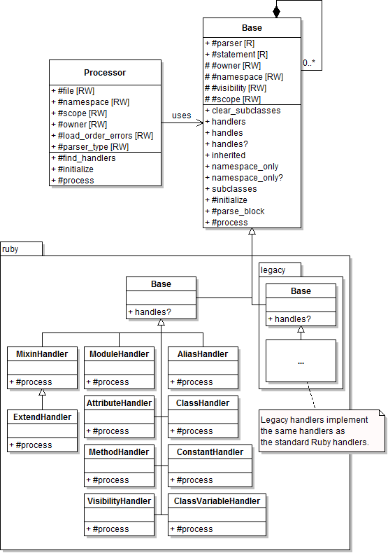

# @title Handlers Architecture

# Handlers Architecture

Handlers allow the processing of parsed source code. Handling is done after
parsing to abstract away the implementation details of lexical and semantic
analysis on source and to only deal with the logic regarding recognizing
source statements as {file:docs/CodeObjects.md code objects}.

## The Pipeline

After the {file:docs/Parser.md parser component} finishes analyzing the
source, it is handed off for post-processing to the {YARD::Handlers::Processor}
class, which is responsible for traversing the set of statements given by
the parser and delegating them to matching handlers. Handlers match when the
{YARD::Handlers::Base.handles?} method returns true for a given statement.
The handler can then perform any action after being invoked by the `process`
method.

## The Processor Class

The main purpose of the processor, as mentioned above, is to traverse through
the list of statements given to it by the parser. The processor also keeps
state about what is being processed. For instance, the processor is what keeps
track of the current namespace (the module or class an object is being defined
in), scope (class or instance), file and owner. The owner refers to the object
that is most directly responsible for the source statement being processed. This
is most often the same as the namespace, except when parsing the body of a method,
where the namespace would be the class/module the method is defined in and the
owner would be the method object itself.

## Implementing a Handler

This section covers the basics of implementing a *new-style* Ruby handler. For
details on implementing a legacy handler, see the "API Differences" section below.

a Ruby handler can be implemented simply by subclassing the {YARD::Handlers::Ruby::Base}
class and declaring what node types or source to process with the {YARD::Handlers::Base.handles handles}
class method. A very simple handler that handles a module definition would be:

    class MyModuleHandler < YARD::Handlers::Ruby::Base
      handles :module

      def process
        puts "Handling a module named #{statement[0].source}"
      end
    end

For details on what nodes are, and what node types are, see the
{file:docs/Parser.md parser architecture document}.

In this case the node type being handled is the `:module` type. More than one
node type or `handles` declarations may describe a single handler, for instance,
a handler that handles class definitions should handle the `:class` and `:sclass`
node types respectively (the latter refers to classes defined as `class << Something`).
The {YARD::Handlers::Base#statement statement} attribute refers to the current
node (or statement) that is being handled by the handler.

### Handling a Method Call

In some cases, a developer might need to handle a method call. The parser can
express a method call in many AST forms, so to simplify this process, a method
call can be handled by declaring the following in a `handles` statement:

    class MyHandler < YARD::Handlers::Ruby::Base
      handles method_call(:describe)

      def process
        # Process the method call
      end
    end

In this case we handle any of the method calls to method name `describe` with
the following syntaxes:

    describe(something)
    describe arg1, arg2, arg3
    describe(something) { perform_a_block }
    describe "Something" do
      a_block
    end

### Creating a new Code Object

Usually (but not always) handling is performed to create new code objects to add
to the registry (for information about code objects, see {file:docs/CodeObjects.md this document}).
Code objects should simply be created and added to the existing `namespace`. This
will be enough to add them to the registry. There is also a convenience
{YARD::Handlers::Base#register register} method which quickly sets standard attributed
on the newly created object, such as the file, line, source and docstring of the
object. This method will be seen in the next example.

### Handling an Inner Block

By default, the parser gives the processor class a list of all the top level
statements and the processor parses only those top level statements. If an inner
block of a module, class, method declaration or even a block passed to a method call
needs to be handled, the {YARD::Handlers::Base#parse_block parse_block} method must be called on the list of statements
to parse. This will send the list to the processor to continue processing on that
statement list. The source tree can be selectively parsed in this manner by parsing
only the inner blocks that are relevant to documentation.

For example, the module handler parses the inner body of a module by performing
the following commands:

    class YARD::Handlers::Ruby::ModuleHandler < YARD::Handlers::Ruby::Base
      handles :module

      def process
        modname = statement[0].source
        mod = register ModuleObject.new(namespace, modname)
        parse_block(statement[1], :namespace => mod)
      end
    end

In this case `statement[1]` refers to a list of extra statements, the block we
wish to parse. Note here that when parsing objects like modules and classes,
we set the namespace for the duration of the block parsing by setting options
on the `parse_block` method.

### API Differences for Legacy Handler

Because the legacy handler uses the legacy parser and therefore a different kind
of AST, there are subtle differences in the handler API. Most importantly, the
`handles` method usually deals with either lexical tokens or source code as a string
or RegExp object. The statement object, similarly, is made up of lexical tokens instead
of semantically parsed nodes (this is described in the {file:docs/Parser.md parser document}).

The module example above can be rewritten as a legacy handler as follows:

    class YARD::Handlers::Ruby::Legacy::ModuleHandler < YARD::Handlers::Ruby::Legacy::Base
      handles TkMODULE

      def process
        modname = statement.tokens.to_s[/^module\s+(#{NAMESPACEMATCH})/, 1]
        mod = register ModuleObject.new(namespace, modname)
        parse_block(:namespace => mod)
      end
    end

A few notes on the differences:

  * We inherit from `Legacy::Base` instead of the standard Ruby Base handler class.
  * We exchange node type `:module` for `TkMODULE`, which represents the
    first token in the statement.
  * We perform direct string manipulation to get the module name.
  * `parse_block` does not take a list of statements. In the old parser API,
    each statement has a `block` attribute which defines the list of
    statements within that statement, if any. Therefore, `parse_block` will
    always parse the `statement.block` if it exists.
