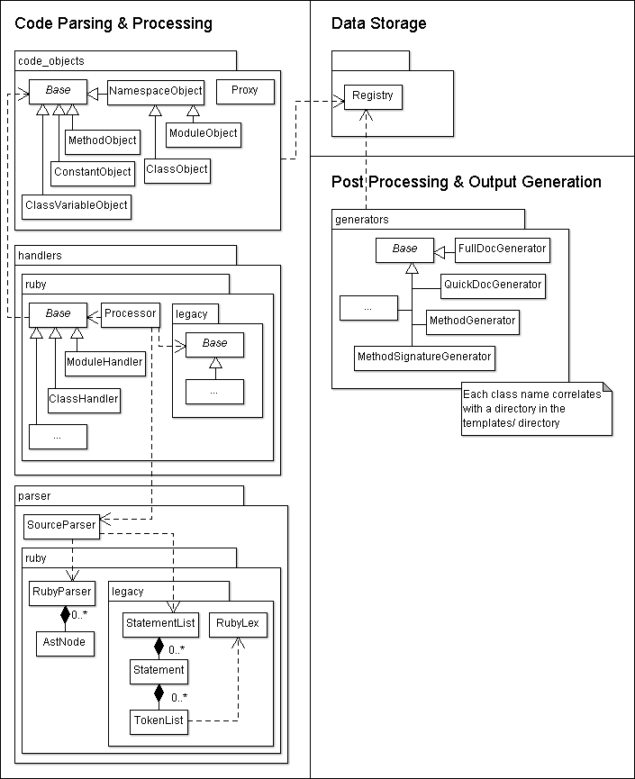

# @title Architecture Overview

# Architecture Overview

YARD is separated in three major components, each of which allows YARD to be
extended for a separate purpose. The split also emphasizes YARD's design choice
to explicitly separate data gathering from HTML document generation, something
that tools like RDoc do not do. These components are:

* [Code Parsing & Processing Component](#parsing)
* [Data Storage Component](#storage)
* [Post Processing & Templating System](#templates)

This separation is a major goal of the project, and means that YARD is not *just*
a tool to generate HTML output. The expectation is that any subset of YARD's
major components may be used, extended or modified independently. YARD may be
used just as a data gathering tool (to parse and audit code), just as a data
source (a webserver containing raw unformatted data about code), or just as a
conventional HTML documentation generation tool (like RDoc).

The important classes and dependencies of these components are shown in the
following class diagram:

## Code Parsing & Processing Component

This component is made up of four sub-components, each of which have separate
tasks during the data gathering process (*note: the tag architecture is not*
*shown in the class diagram*). These sub-components are:

  * {file:docs/Parser.md}
  * {file:docs/Handlers.md}
  * {file:docs/CodeObjects.md}
  * {file:docs/Tags.md}

The parser component reads source files and converts it into a set of statements
which the handlers then process, creating code objects which in turn create tags
(meta-data) attached to the objects. These objects are all added to the {YARD::Registry},
the data store component.

## Data Storage Component

This component is currently implemented as a simple Ruby marshalled flat namespace
of object. The implementation is found in the single class {YARD::Registry}, which
is the centralized repository for all data being parsed, stored and accessed. There
are future plans to improve this storage mechanism to be backend agnostic and allow
for more robust storage.

## Post Processing & Templating System

This component handles processing of objects from the registry through a templating
engine that allows output to a variety of formats. Practically speaking, this is
where templates can be implemented to change the design, output or structure of
the data. See {file:docs/Templates.md Templates Architecture} for a complete overview.
