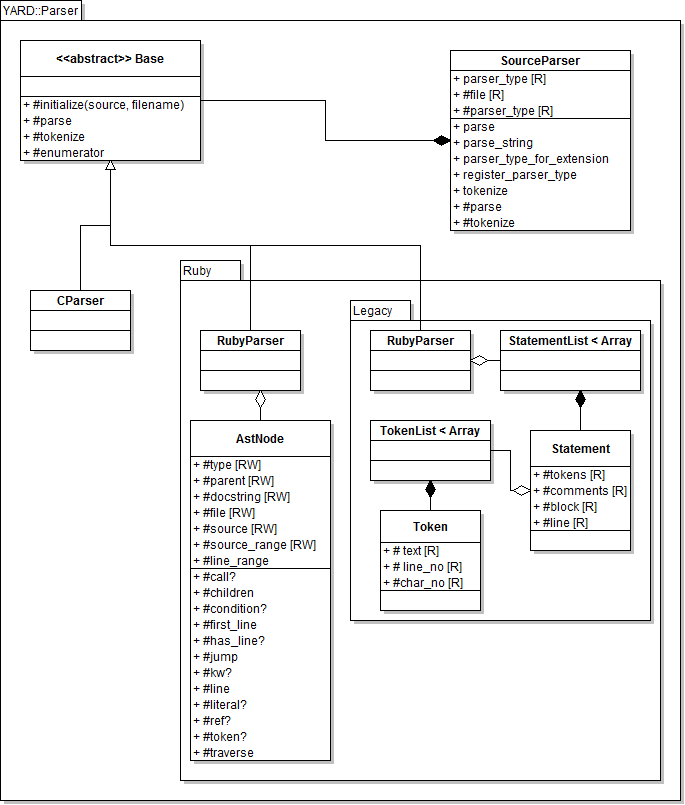

# @title Parser Architecture

# Parser Architecture

The parser component of YARD is the first component in the data processing pipeline
that runs before any handling is done on the source. The parser is meant to translate
the source into a set of statements that can be understood by the {file:docs/Handlers.md Handlers}
that run immediately afterwards.

The important classes are described in the class diagram of the entire parser
system below:

(Note: the RubyToken classes are omitted from the diagram)

## SourceParser

The main class {YARD::Parser::SourceParser} acts as a factory class, instantiating
the correct parser class, an implementation of {YARD::Parser::Base}. The selected parser
is chosen based on either the file extension or by selecting it explicitly (as an argument
to parsing methods). YARD supports Ruby and C source files, but custom parsers can
be implemented and registered for various other languages by subclassing `Parser::Base`
and registering the parser with {YARD::Parser::SourceParser.register_parser_type}.

This factory class should always be used when parsing source files rather than
the individual parser classes since it initiates the pipeline that runs the
handlers on the parsed source. The parser used must also match the handlers,
and this is coordinated by the `SourceParser` class as well.

## Using the SourceParser Class

The `SourceParser` class API is optimized for parsing globs of files. As such,
the main method to use the class is the `parse` class method, which takes an
array of file globs or a single file glob.

    YARD::Parser::SourceParser.parse('spec_*.rb')
    YARD::Parser::SourceParser.parse(['spec_*.rb', '*_helper.rb'])

This is equivalent to the convenience method {YARD.parse}:

    YARD.parse('lib/**/*.rb')

In some cases (ie. for testing), it may be more helpful to parse a string of input
directly. In such a case, the method {YARD::Parser::SourceParser.parse_string} should be
used:

    YARD::Parser::SourceParser.parse_string("def method(a, b) end")

You can also provide the parser type explicitly as the second argument:

    # Parses a string of C
    YARD::Parser::SourceParser.parse_string("int main() { }", :c)

Note that these two methods are aliased as {YARD.parse} and {YARD.parse_string} for
convenience.

## Implementing and Registering a Custom Parser

To implement a custom parser, subclass {YARD::Parser::Base}. Documentation on which
abstract methods should be implemented are documented in that class. After the class
is implemented, it is registered with the {YARD::Parser::SourceParser} factory class
to be called when a file of the right extension needs to be parsed, or when a user
selects that parser type explicitly. To register your new parser class, call the
method {YARD::Parser::SourceParser.register_parser_type}:

    SourceParser.register_parser_type(:my_parser, MyParser, 'my_parser_ext')

The last argument can be a single extension, a list of extensions (Array), a single Regexp, or a
list of Regexps. Do not include the '.' in the extension.

## The Two Ruby Parser Types

When parsing Ruby, the SourceParser can either instantiate the new {YARD::Parser::Ruby::RubyParser}
class or the {YARD::Parser::Ruby::Legacy::StatementList} class. The first of the
two, although faster, more robust and more efficient, is only available for
Ruby 1.9. The legacy parser parser is available in both 1.8.x and 1.9, if
compatibility is required. The choice of parser will affect which handlers
ultimately get used, since new handlers can only use the new parser and the
same requirement applies to the legacy parser & handlers.

## Switching to Legacy Parser

By default, running YARD under Ruby 1.9 will automatically select the new parser
and new handlers by extension. Although YARD supports both handler styles, plugins
may choose to only implement one of the two (though this is not recommended). If
only the legacy handlers are implemented, the `SourceParser` class should force
the use of the legacy parser by setting the `parser_type` attribute as such:

    YARD::Parser::SourceParser.parser_type = :ruby18

The default value is `:ruby`. Note that this cannot be forced the other way around,
a parser type of `:ruby` cannot be set under Ruby 1.8.x as the new parser is not
supported under 1.8.

## RubyParser (the New Parser)

The new Ruby parser uses the Ripper library that is packaged as part of stdlib
in Ruby 1.9. Because of this, it can generate an AST from a string of Ruby input
that is similar to the style of other sexp libraries (such as ParseTree). Each
node generated in the tree is of the base type {YARD::Parser::Ruby::AstNode},
which has some subclasses for common node types.

### AstNode Basics

The `AstNode` class behaves like a standard Array class in which all of its data
make up the list of elements in the array. Unlike other sexp style libraries, however,
the node type is not the first element of the list. Instead, the node type is defined
by the `#type` method. The following examples show some of the basic uses of `AstNode`:

    # The sexp defines the statement `hello if 1`
    node = s(:if_mod, s(:int, "1"), s(:var_ref, s(:ident, "hello")))
    node.type  #=> :if_mod
    node[0]    #=> s(:int, "1")
    node[0][0] #=> "1"

(Note the `s()` syntax is shorthand for `AstNode.new(...)`. `s()` with no type
is shorthand for a node of type `:list`)

As shown, not all of the elements are AstNodes in themselves, some are String
objects containing values. A list of only the AstNodes within a node can be
accessed via the {YARD::Parser::Ruby::AstNode#children #children} method. Using
the sexp declared above, we can do:

    node.children #=> [s(:int, "1"), s(:var_ref, s(:ident, "hello"))]

### AstNode#source and #line

Every node defines the `#source` method which returns the source code that the
node represents. One of the most common things to do with a node is to grab its
source. The following example shows how this can be done:

    source = "if 1 == 1 then\n  raise Exception\n end"
    ast = YARD::Parser::Ruby::RubyParser.parse(source).root
    ast[0].condition.source  #=> "1 == 1"
    ast[0].then_block.source #=> "raise Exception"

Note that this only works on source parsed from the RubyParser, not sexps
declared using the `s()` syntax. This is because no source code is generated
or stored by nodes. Instead, only the character ranges are stored, which are
then looked up in the original full source string object. For example:

    # Following the code snippet above
    ast[0].then_block.source_range #=> 17..31

We can also get the line and line ranges in a similar fashion:

    ast[0].type       #=> :if
    ast[0].line       #=> 1
    ast[0].line_range #=> 1..3 (note the newlines in the source)

### AstNode#jump

Often the AST will be such that the node we care about might be buried arbitrarily
deep in a node's hierarchy. The {YARD::Parser::Ruby::AstNode#jump} method exists
to quickly get at a node of a specific type in such a situation:

    # Get the first identifier in the statement
    ast = s(s(:int, "1"), s(s(:var_ref, s(:ident, "hello"))))
    ast.jump(:ident)[0] #=> "hello"

Multiple types can be searched for at once. If none are found, the original root
node is returned so that it may be chained.

## The Legacy Parser

The goal of the legacy parser is much the same as the new parser, but it is far
more simplistic. Instead of a full-blown AST, the legacy parser simply groups
together lists of "statements" called a {YARD::Parser::Ruby::Legacy::StatementList}.
These statement lists are made up of {YARD::Parser::Ruby::Legacy::Statement} objects.
A statement is any method call condition, loop, or declaration. Each statement
may or may not have a block. In the case of a condition or loop, the block is
the inner list of statements; in the case of a method call, the block is a do
block (if provided). The statements themselves are made up of tokens, so instead
of being semantic in nature like the new parser, statements are tied directly
to the lexical tokens that make them up. To convert a statement into source, you
simply join all the tokens together (this is done through the use of `#to_s`).

Note that because there is little semantic parsing, the legacy parser is less
able to deal with certain Ruby syntaxes. Specifically, the `:if_mod` syntax
seen above ("hello if 1") would be considered two statements with the new parser,
but using the legacy parser it is only one statement:

    stmts = ARD::Parser::Ruby::Legacy::StatementList.new("hello if 1")
    stmts[0].block       #=> nil
    stmts[0].tokens.to_s #=> "hello if 1"

In addition, this means that most handling still needs to be done via string
manipulation and regular expression matching, making it considerably more
difficult to use in edge case scenarios.
