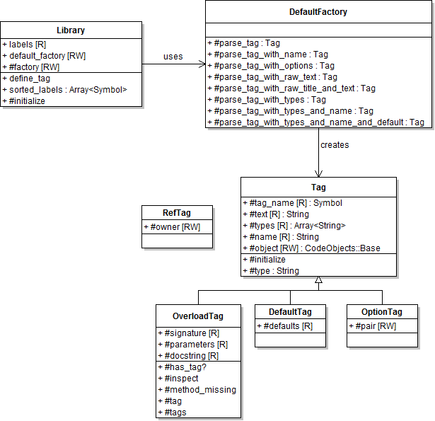

# @title Tags Architecture

# Tags Architecture

## Programmatic API

### Accessing Tag Information

Tag metadata is added when a {YARD::Docstring} is added to a {file:docs/CodeObjects.md code object}
using the {YARD::CodeObjects::Base#docstring=} attribute. In addition to adding
conventional comments, tags are parsed and associated with the object. The easiest
way to access tags on an object is to use the {YARD::CodeObjects::Base#tag} and `#tags`
methods, for example:

    # Using the Foo class object from above
    obj.tags(:tagname).first.text #=> "some data"

Because multiple tags can be stored with the same name, they are stored as a list
of tags. The `#tag` method is an alias for the first item in the list of tags.
Also note that the `#tag`, `#tags` and `#has_tag?` methods are all convenience
methods that delegate to the {YARD::Docstring} object described above.

### Adding Custom Tags

The `@tagname` tag used in the above examples is clearly not part of the tags
that come with YARD. If such a tag would actually be part of documentation under
a default install, YARD would raise a warning that the tag does not exist. It is,
however, trivial to add this tag to be recognized by YARD.

All tags in YARD are added to the {YARD::Tags::Library tag library} which makes
use of a tag factory class to parse the data inside the tags. To simply add a
tag that stores simple text like our `@tagname` tag above, use:

    YARD::Tags::Library.define_tag("A Sample Tag", :tagname)

This will now allow YARD to add the metadata from `@tagname` to the docstring.

## Tag Factory Architecture

Recognizing a tag is one part of the process. Parsing the tag contents is the
second step. YARD has a tag architecture that allows developers to add or completely
change the way tags contents can be parsed.

The separation of registration and tag creation can be seen in the following
class diagram:

### DefaultFactory

By default, YARD has a few standard syntaxes that can be parsed for tags. These
are all implemented by the {YARD::Tags::DefaultFactory} class. These syntaxes
are:

  * Standard text: no parsing is done, but text is stripped of newlines and
    multiple spaces.

  * Raw text: does no parsing at all, no stripping of newlines or spaces. This
    is best used for code snippets.

  * Raw text with title: does no parsing on the text but extracts the first line
    of the metadata as the "title", useful for tags such as `@example`:

        # @example Inspect an element
        #   myobj.inspect #=> #<Object:0x123525>

  * Text with types: parses a list of types at the beginning of the text. Types
    are optional. The standard syntax is in the form `[type1, type2, ...]`,
    for example:

        # @return [String, Symbol] a description here
        # @return description here with no types

  * Text with types and a name: parses a list of types at the beginning of text
    followed by a name and extra descriptive text. For example:

        # @param [String] str the string to reverse
        def reverse(str) '...' end

As mentioned above, this syntax is implemented by the `DefaultFactory` which can
be swapped out for any factory. In some cases, a developer may want to change
the type declaration syntax to be in the form:

    # @tagname name <Types, here> description

This can be done by simply implementing a new factory that parses the data in
this form.

### Implementing a Factory

Factories should implement the method `parse_tag` as well as any `parse_tag_SUFFIX`
method where SUFFIX refers to the suffix added when declaring the tag. For example,
a tag can also be declared as follows:

    YARD::Tags::Library.define_tag "Parameter", :param, :with_types

In such a case, the factory will be called with method `parse_tag_with_types`. In
all cases, the method should return a new {YARD::Tags::Tag} object. Generally,
the `parse_tag` methods take 2 or 3 parameters. A simple tag can be implemented
as:

    def parse_tag(tag_name, text)
      Tag.new(tag_name, text)
    end

The text parameter contains pre-parsed text with extra spaces and newlines removed.
If required, the method could also be declared with a third parameter containing
unmodified raw text:

    def parse_tag_with_raw_text(tag_name, text, raw_text)
      Tag.new(tag_name, raw_text)
    end

Note that this method would be invoked for a tag declared with the `:with_raw_text`
suffix.

### Changing the Factory

To change the factory, set the {YARD::Tags::Library.default_factory} attribute:

    YARD::Tags::Library.default_factory = MyFactory

This must be done before any parsing is done, or the factory will not be used.
